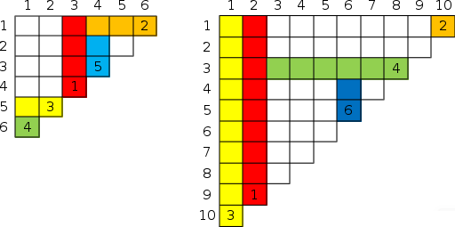

<h1 style='text-align: center;'> C. Case of Chocolate</h1>

<h5 style='text-align: center;'>time limit per test: 3 seconds</h5>
<h5 style='text-align: center;'>memory limit per test: 256 megabytes</h5>

Andrewid the Android is a galaxy-known detective. Now he does not investigate any case and is eating chocolate out of boredom.

A bar of chocolate can be presented as an *n* × *n* table, where each cell represents one piece of chocolate. The columns of the table are numbered from 1 to *n* from left to right and the rows are numbered from top to bottom. Let's call the anti-diagonal to be a diagonal that goes the lower left corner to the upper right corner of the table. First Andrewid eats all the pieces lying below the anti-diagonal. Then he performs the following *q* actions with the remaining triangular part: first, he chooses a piece on the anti-diagonal and either direction 'up' or 'left', and then he begins to eat all the pieces starting from the selected cell, moving in the selected direction until he reaches the already eaten piece or chocolate bar edge.

After each action, he wants to know how many pieces he ate as a result of this action.

## Input

The first line contains integers *n* (1 ≤ *n* ≤ 109) and *q* (1 ≤ *q* ≤ 2·105) — the size of the chocolate bar and the number of actions.

Next *q* lines contain the descriptions of the actions: the *i*-th of them contains numbers *x**i* and *y**i* (1 ≤ *x**i*, *y**i* ≤ *n*, *x**i* + *y**i* = *n* + 1) — the numbers of the column and row of the chosen cell and the character that represents the direction (L — left, U — up).

## Output

Print *q* lines, the *i*-th of them should contain the number of eaten pieces as a result of the *i*-th action.

## Examples

## Input


```
6 5  
3 4 U  
6 1 L  
2 5 L  
1 6 U  
4 3 U  

```
## Output


```
4  
3  
2  
1  
2  

```
## Input


```
10 6  
2 9 U  
10 1 U  
1 10 U  
8 3 L  
10 1 L  
6 5 U  

```
## Output


```
9  
1  
10  
6  
0  
2  

```
## Note

Pictures to the sample tests:



The pieces that were eaten in the same action are painted the same color. The pieces lying on the anti-diagonal contain the numbers of the action as a result of which these pieces were eaten.

In the second sample test the Andrewid tries to start eating chocolate for the second time during his fifth action, starting from the cell at the intersection of the 10-th column and the 1-st row, but this cell is already empty, so he does not eat anything.


#### tags 

#2200 #data_structures 