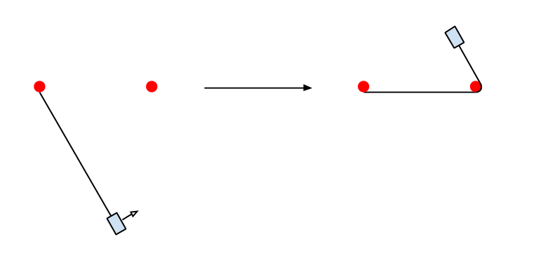
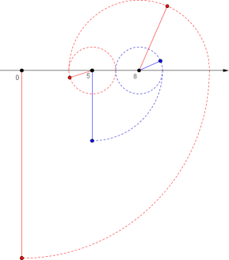
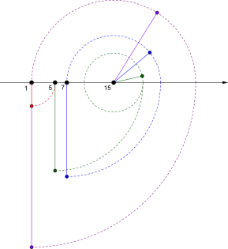

<h1 style='text-align: center;'> D. Case of a Top Secret</h1>

<h5 style='text-align: center;'>time limit per test: 2 seconds</h5>
<h5 style='text-align: center;'>memory limit per test: 256 megabytes</h5>

Andrewid the Android is a galaxy-famous detective. Now he is busy with a top secret case, the details of which are not subject to disclosure.

However, he needs help conducting one of the investigative experiment. There are *n* pegs put on a plane, they are numbered from 1 to *n*, the coordinates of the *i*-th of them are (*x**i*, 0). Then, we tie to the bottom of one of the pegs a weight on a tight rope of length *l* (thus, its coordinates will be equal to (*x**i*,  - *l*), where *i* is the number of the used peg). Then the weight is pushed to the right, so that it starts to rotate counterclockwise. At the same time, if the weight during rotation touches some of the other pegs, it then begins to rotate around that peg. Suppose that each peg itself is very thin and does not affect the rope length while weight is rotating around it.

  More formally, if at some moment the segment of the rope contains one or more pegs in addition to the peg around which the weight is rotating, the weight will then rotate around the farthermost one of them on a shorter segment of a rope. In particular, if the segment of the rope touches some peg by its endpoint, it is considered that the weight starts to rotate around that peg on a segment of the rope of length 0.

At some moment the weight will begin to rotate around some peg, without affecting the rest of the pegs. Andrewid interested in determining the number of this peg.

Andrewid prepared *m* queries containing initial conditions for pushing the weight, help him to determine for each of them, around what peg the weight will eventually rotate.

## Input

The first line contains integers *n* and *m* (1 ≤ *n*, *m* ≤ 2·105) — the number of pegs and queries.

The next line contains *n* integers *x*1, *x*2, ..., *x**n* ( - 109 ≤ *x**i* ≤ 109) — the coordinates of the pegs. It is guaranteed that the coordinates of all the pegs are distinct integers.

Next *m* lines contain the descriptions of the queries of pushing the weight, each consists of two integers *a**i* (1 ≤ *a**i* ≤ *n*) and *l**i* (1 ≤ *l**i* ≤ 109) — the number of the starting peg and the length of the rope.

## Output

Print *m* lines, the *i*-th line should contain the number of the peg around which the weight will eventually rotate after the *i*-th push.

## Examples

## Input


```
3 2  
0 3 5  
2 3  
1 8  

```
## Output


```
3  
2  

```
## Input


```
4 4  
1 5 7 15  
1 4  
2 15  
3 16  
1 28  

```
## Output


```
2  
4  
3  
1  

```
## Note

Picture to the first sample test:

 

Picture to the second sample test:



## Note

 that in the last query weight starts to rotate around the peg 1 attached to a rope segment of length 0.


#### tags 

#2500 #binary_search #implementation #math 