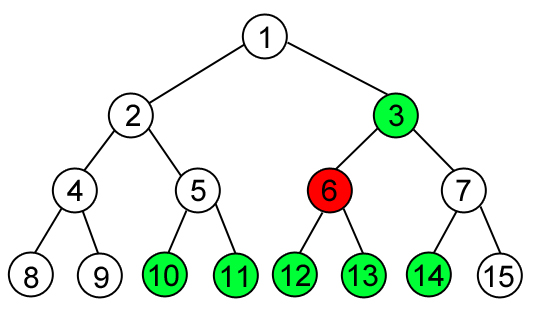

<h1 style='text-align: center;'> D. Guess Your Way Out! II</h1>

<h5 style='text-align: center;'>time limit per test: 2 seconds</h5>
<h5 style='text-align: center;'>memory limit per test: 256 megabytes</h5>

Amr bought a new video game "Guess Your Way Out! II". The goal of the game is to find an exit from the maze that looks like a perfect binary tree of height *h*. The player is initially standing at the root of the tree and the exit from the tree is located at some leaf node.

Let's index all the nodes of the tree such that 

* The root is number 1
* Each internal node *i* (*i* ≤ 2*h* - 1 - 1) will have a left child with index = 2*i* and a right child with index = 2*i* + 1

The level of a node is defined as 1 for a root, or 1 + level of parent of the node otherwise. The vertices of the level *h* are called leaves. The exit to the maze is located at some leaf node *n*, the player doesn't know where the exit is so he has to guess his way out! 

In the new version of the game the player is allowed to ask questions on the format "Does the *ancestor*(*exit*, *i*) node number belong to the range [*L*, *R*]?". Here *ancestor*(*v*, *i*) is the ancestor of a node *v* that located in the level *i*. The game will answer with "Yes" or "No" only. The game is designed such that it doesn't always answer correctly, and sometimes it cheats to confuse the player!.

Amr asked a lot of questions and got confused by all these answers, so he asked you to help him. Given the questions and its answers, can you identify whether the game is telling contradictory information or not? If the information is not contradictory and the exit node can be determined uniquely, output its number. If the information is not contradictory, but the exit node isn't defined uniquely, output that the number of questions is not sufficient. Otherwise output that the information is contradictory.

## Input

The first line contains two integers *h*, *q* (1 ≤ *h* ≤ 50, 0 ≤ *q* ≤ 105), the height of the tree and the number of questions respectively.

The next *q* lines will contain four integers each *i*, *L*, *R*, *ans* (1 ≤ *i* ≤ *h*, 2*i* - 1 ≤ *L* ≤ *R* ≤ 2*i* - 1, ), representing a question as described in the statement with its answer (*ans* = 1 if the answer is "Yes" and *ans* = 0 if the answer is "No").

## Output

If the information provided by the game is contradictory output "Game cheated!" without the quotes.

Else if you can uniquely identify the exit to the maze output its index. 

Otherwise output "Data not sufficient!" without the quotes.

## Examples

## Input


```
3 1  
3 4 6 0  

```
## Output


```
7
```
## Input


```
4 3  
4 10 14 1  
3 6 6 0  
2 3 3 1  

```
## Output


```
14
```
## Input


```
4 2  
3 4 6 1  
4 12 15 1  

```
## Output


```
Data not sufficient!
```
## Input


```
4 2  
3 4 5 1  
2 3 3 1  

```
## Output


```
Game cheated!
```
## Note

Node *u* is an ancestor of node *v* if and only if 

* *u* is the same node as *v*,
* *u* is the parent of node *v*,
* or *u* is an ancestor of the parent of node *v*.

In the first sample test there are 4 leaf nodes 4, 5, 6, 7. The first question says that the node isn't in the range [4, 6] so the exit is node number 7.

In the second sample test there are 8 leaf nodes. After the first question the exit is in the range [10, 14]. After the second and the third questions only node number 14 is correct. Check the picture below to fully understand.




#### tags 

#2300 #data_structures #implementation #sortings 