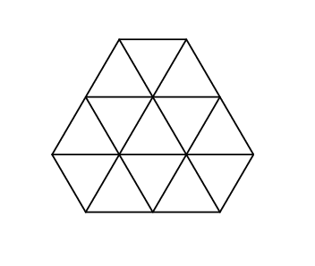

<h1 style='text-align: center;'> A. Gerald's Hexagon</h1>

<h5 style='text-align: center;'>time limit per test: 2 seconds</h5>
<h5 style='text-align: center;'>memory limit per test: 256 megabytes</h5>

Gerald got a very curious hexagon for his birthday. The boy found out that all the angles of the hexagon are equal to . Then he measured the length of its sides, and found that each of them is equal to an integer number of centimeters. There the properties of the hexagon ended and Gerald decided to draw on it.

He painted a few lines, parallel to the sides of the hexagon. The lines split the hexagon into regular triangles with sides of 1 centimeter. Now Gerald wonders how many triangles he has got. But there were so many of them that Gerald lost the track of his counting. Help the boy count the triangles.

## Input

The first and the single line of the input contains 6 space-separated integers *a*1, *a*2, *a*3, *a*4, *a*5 and *a*6 (1 ≤ *a**i* ≤ 1000) — the lengths of the sides of the hexagons in centimeters in the clockwise order. It is guaranteed that the hexagon with the indicated properties and the exactly such sides exists.

## Output

Print a single integer — the number of triangles with the sides of one 1 centimeter, into which the hexagon is split.

## Examples

## Input


```
1 1 1 1 1 1  

```
## Output


```
6  

```
## Input


```
1 2 1 2 1 2  

```
## Output


```
13  

```
## Note

This is what Gerald's hexagon looks like in the first sample:


And that's what it looks like in the second sample:




#### tags 

#1600 #brute_force #geometry #math 