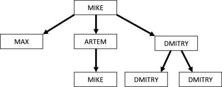

<h1 style='text-align: center;'> C. Corporation Mail</h1>

<h5 style='text-align: center;'>time limit per test: 2 seconds</h5>
<h5 style='text-align: center;'>memory limit per test: 256 megabytes</h5>

The Beroil corporation structure is hierarchical, that is it can be represented as a tree. Let's examine the presentation of this structure as follows:

* *employee* ::= *name*. | *name*:*employee*1,*employee*2, ... ,*employee**k*.
* *name* ::= name of an employee

That is, the description of each employee consists of his name, a colon (:), the descriptions of all his subordinates separated by commas, and, finally, a dot. If an employee has no subordinates, then the colon is not present in his description.

For example, line MIKE:MAX.,ARTEM:MIKE..,DMITRY:DMITRY.,DMITRY... is the correct way of recording the structure of a corporation where the director MIKE has subordinates MAX, ARTEM and DMITRY. ARTEM has a subordinate whose name is MIKE, just as the name of his boss and two subordinates of DMITRY are called DMITRY, just like himself.

In the Beroil corporation every employee can only correspond with his subordinates, at that the subordinates are not necessarily direct. Let's call an uncomfortable situation the situation when a person whose name is *s* writes a letter to another person whose name is also *s*. In the example given above are two such pairs: a pair involving MIKE, and two pairs for DMITRY (a pair for each of his subordinates).

Your task is by the given structure of the corporation to find the number of uncomfortable pairs in it.

## Input

The first and single line contains the corporation structure which is a string of length from 1 to 1000 characters. It is guaranteed that the description is correct. Every name is a string consisting of capital Latin letters from 1 to 10 symbols in length.

## Output

Print a single number — the number of uncomfortable situations in the company.

## Examples

## Input


```
MIKE:MAX.,ARTEM:MIKE..,DMITRY:DMITRY.,DMITRY...  

```
## Output


```
3  

```
## Input


```
A:A..  

```
## Output


```
1  

```
## Input


```
A:C:C:C:C.....  

```
## Output


```
6  

```


#### tags 

#1700 #data_structures #expression_parsing #implementation 