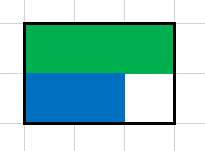
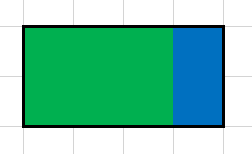

<h1 style='text-align: center;'> B. Gerald is into Art</h1>

<h5 style='text-align: center;'>time limit per test: 2 seconds</h5>
<h5 style='text-align: center;'>memory limit per test: 256 megabytes</h5>

Gerald bought two very rare paintings at the Sotheby's auction and he now wants to hang them on the wall. For that he bought a special board to attach it to the wall and place the paintings on the board. The board has shape of an *a*1 × *b*1 rectangle, the paintings have shape of a *a*2 × *b*2 and *a*3 × *b*3 rectangles.

Since the paintings are painted in the style of abstract art, it does not matter exactly how they will be rotated, but still, one side of both the board, and each of the paintings must be parallel to the floor. The paintings can touch each other and the edges of the board, but can not overlap or go beyond the edge of the board. Gerald asks whether it is possible to place the paintings on the board, or is the board he bought not large enough?

## Input

The first line contains two space-separated numbers *a*1 and *b*1 — the sides of the board. Next two lines contain numbers *a*2, *b*2, *a*3 and *b*3 — the sides of the paintings. All numbers *a**i*, *b**i* in the input are integers and fit into the range from 1 to 1000.

## Output

If the paintings can be placed on the wall, print "YES" (without the quotes), and if they cannot, print "NO" (without the quotes).

## Examples

## Input


```
3 2  
1 3  
2 1  

```
## Output


```
YES  

```
## Input


```
5 5  
3 3  
3 3  

```
## Output


```
NO  

```
## Input


```
4 2  
2 3  
1 2  

```
## Output


```
YES  

```
## Note

That's how we can place the pictures in the first test:



And that's how we can do it in the third one.




#### tags 

#1200 #constructive_algorithms #implementation 