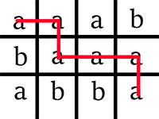
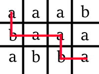
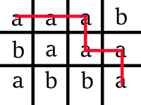

<h1 style='text-align: center;'> E. Pig and Palindromes</h1>

<h5 style='text-align: center;'>time limit per test: 4 seconds</h5>
<h5 style='text-align: center;'>memory limit per test: 256 megabytes</h5>

Peppa the Pig was walking and walked into the forest. What a strange coincidence! The forest has the shape of a rectangle, consisting of *n* rows and *m* columns. We enumerate the rows of the rectangle from top to bottom with numbers from 1 to *n*, and the columns — from left to right with numbers from 1 to *m*. Let's denote the cell at the intersection of the *r*-th row and the *c*-th column as (*r*, *c*).

Initially the pig stands in cell (1, 1), and in the end she wants to be in cell (*n*, *m*). Since the pig is in a hurry to get home, she can go from cell (*r*, *c*), only to either cell (*r* + 1, *c*) or (*r*, *c* + 1). She cannot leave the forest.

The forest, where the pig is, is very unusual. Some cells of the forest similar to each other, and some look very different. Peppa enjoys taking pictures and at every step she takes a picture of the cell where she is now. The path through the forest is considered to be beautiful if photographs taken on her way, can be viewed in both forward and in reverse order, showing the same sequence of photos. More formally, the line formed by the cells in order of visiting should be a palindrome (you can read a formal definition of a palindrome in the previous problem).

Count the number of beautiful paths from cell (1, 1) to cell (*n*, *m*). Since this number can be very large, determine the remainder after dividing it by 109 + 7.

## Input

The first line contains two integers *n*, *m* (1 ≤ *n*, *m* ≤ 500) — the height and width of the field.

Each of the following *n* lines contains *m* lowercase English letters identifying the types of cells of the forest. Identical cells are represented by identical letters, different cells are represented by different letters.

## Output

Print a single integer — the number of beautiful paths modulo 109 + 7.

## Examples

## Input


```
3 4  
aaab  
baaa  
abba  

```
## Output


```
3
```
## Note

Picture illustrating possibilities for the sample test. 

   

 


#### tags 

#2300 #combinatorics #dp 