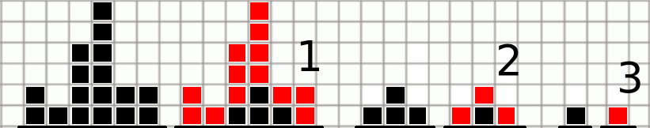

<h1 style='text-align: center;'> B. Bear and Blocks</h1>

<h5 style='text-align: center;'>time limit per test: 1 second</h5>
<h5 style='text-align: center;'>memory limit per test: 256 megabytes</h5>

Limak is a little bear who loves to play. Today he is playing by destroying block towers. He built *n* towers in a row. The *i*-th tower is made of *h**i* identical blocks. For clarification see picture for the first sample.

Limak will repeat the following operation till everything is destroyed.

Block is called internal if it has all four neighbors, i.e. it has each side (top, left, down and right) adjacent to other block or to the floor. Otherwise, block is boundary. In one operation Limak destroys all boundary blocks. His paws are very fast and he destroys all those blocks at the same time.

Limak is ready to start. You task is to count how many operations will it take him to destroy all towers.

## Input

The first line contains single integer *n* (1 ≤ *n* ≤ 105).

The second line contains *n* space-separated integers *h*1, *h*2, ..., *h**n* (1 ≤ *h**i* ≤ 109) — sizes of towers.

## Output

Print the number of operations needed to destroy all towers.

## Examples

## Input


```
6  
2 1 4 6 2 2  

```
## Output


```
3  

```
## Input


```
7  
3 3 3 1 3 3 3  

```
## Output


```
2  

```
## Note

The picture below shows all three operations for the first sample test. Each time boundary blocks are marked with red color. 

   After first operation there are four blocks left and only one remains after second operation. This last block is destroyed in third operation.

#### tags 

#1600 #binary_search #data_structures #dp #math 