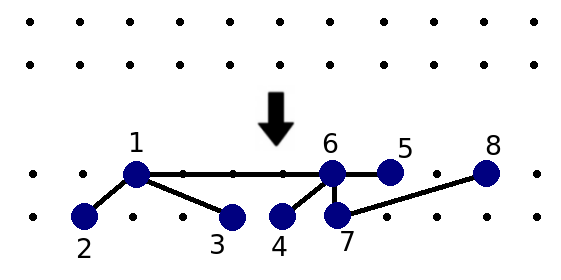

<h1 style='text-align: center;'> C. Bear and Drawing</h1>

<h5 style='text-align: center;'>time limit per test: 1 second</h5>
<h5 style='text-align: center;'>memory limit per test: 256 megabytes</h5>

Limak is a little bear who learns to draw. People usually start with houses, fences and flowers but why would bears do it? Limak lives in the forest and he decides to draw a tree.

Recall that tree is a connected graph consisting of *n* vertices and *n* - 1 edges.

Limak chose a tree with *n* vertices. He has infinite strip of paper with two parallel rows of dots. Little bear wants to assign vertices of a tree to some *n* distinct dots on a paper so that edges would intersect only at their endpoints — drawn tree must be planar. Below you can see one of correct drawings for the first sample test.

  Is it possible for Limak to draw chosen tree?

## Input

The first line contains single integer *n* (1 ≤ *n* ≤ 105).

Next *n* - 1 lines contain description of a tree. *i*-th of them contains two space-separated integers *a**i* and *b**i* (1 ≤ *a**i*, *b**i* ≤ *n*, *a**i* ≠ *b**i*) denoting an edge between vertices *a**i* and *b**i*. It's guaranteed that given description forms a tree.

## Output

Print "Yes" (without the quotes) if Limak can draw chosen tree. Otherwise, print "No" (without the quotes).

## Examples

## Input


```
8  
1 2  
1 3  
1 6  
6 4  
6 7  
6 5  
7 8  

```
## Output


```
Yes  

```
## Input


```
13  
1 2  
1 3  
1 4  
2 5  
2 6  
2 7  
3 8  
3 9  
3 10  
4 11  
4 12  
4 13  

```
## Output


```
No  

```


#### tags 

#2300 #constructive_algorithms #dfs_and_similar #trees 