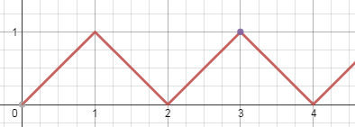
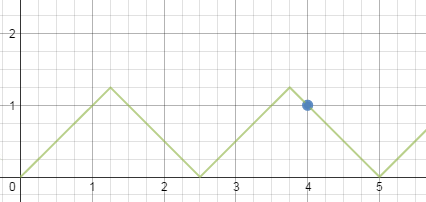

<h1 style='text-align: center;'> A. A Problem about Polyline</h1>

<h5 style='text-align: center;'>time limit per test: 1 second</h5>
<h5 style='text-align: center;'>memory limit per test: 256 megabytes</h5>

There is a polyline going through points (0, 0) – (*x*, *x*) – (2*x*, 0) – (3*x*, *x*) – (4*x*, 0) – ... - (2*kx*, 0) – (2*kx* + *x*, *x*) – .... 

We know that the polyline passes through the point (*a*, *b*). Find minimum positive value *x* such that it is true or determine that there is no such *x*.

## Input

Only one line containing two positive integers *a* and *b* (1 ≤ *a*, *b* ≤ 109).

## Output

## Output

 the only line containing the answer. Your answer will be considered correct if its relative or absolute error doesn't exceed 10- 9. If there is no such *x* then output  - 1 as the answer.

## Examples

## Input


```
3 1  

```
## Output


```
1.000000000000  

```
## Input


```
1 3  

```
## Output


```
-1  

```
## Input


```
4 1  

```
## Output


```
1.250000000000  

```
## Note

You can see following graphs for sample 1 and sample 3. 

    

#### tags 

#1700 #geometry #math 