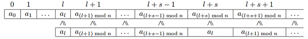

<h1 style='text-align: center;'> C. Superior Periodic Subarrays</h1>

<h5 style='text-align: center;'>time limit per test: 1 second</h5>
<h5 style='text-align: center;'>memory limit per test: 256 megabytes</h5>

You are given an infinite periodic array *a*0, *a*1, ..., *a**n* - 1, ... with the period of length *n*. Formally, . A periodic subarray (*l*, *s*) (0 ≤ *l* < *n*, 1 ≤ *s* < *n*) of array *a* is an infinite periodic array with a period of length *s* that is a subsegment of array *a*, starting with position *l*.

A periodic subarray (*l*, *s*) is superior, if when attaching it to the array *a*, starting from index *l*, any element of the subarray is larger than or equal to the corresponding element of array *a*. An example of attaching is given on the figure (top — infinite array *a*, bottom — its periodic subarray (*l*, *s*)):

  Find the number of distinct pairs (*l*, *s*), corresponding to the superior periodic arrays.

## Input

The first line contains number *n* (1 ≤ *n* ≤ 2·105). The second line contains *n* numbers *a*0, *a*1, ..., *a**n* - 1 (1 ≤ *a**i* ≤ 106), separated by a space.

## Output

Print a single integer — the sought number of pairs.

## Examples

## Input


```
4  
7 1 2 3  

```
## Output


```
2  

```
## Input


```
2  
2 1  

```
## Output


```
1  

```
## Input


```
3  
1 1 1  

```
## Output


```
6  

```
## Note

In the first sample the superior subarrays are (0, 1) and (3, 2).

Subarray (0, 1) is superior, as *a*0 ≥ *a*0, *a*0 ≥ *a*1, *a*0 ≥ *a*2, *a*0 ≥ *a*3, *a*0 ≥ *a*0, ...

Subarray (3, 2) is superior *a*3 ≥ *a*3, *a*0 ≥ *a*0, *a*3 ≥ *a*1, *a*0 ≥ *a*2, *a*3 ≥ *a*3, ...

In the third sample any pair of (*l*, *s*) corresponds to a superior subarray as all the elements of an array are distinct.


#### tags 

#2400 #number_theory 