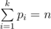

<h1 style='text-align: center;'> D. Dima and Lisa</h1>

<h5 style='text-align: center;'>time limit per test: 1 second</h5>
<h5 style='text-align: center;'>memory limit per test: 256 megabytes</h5>

Dima loves representing an odd number as the sum of multiple primes, and Lisa loves it when there are at most three primes. Help them to represent the given number as the sum of at most than three primes.

More formally, you are given an odd numer *n*. Find a set of numbers *p**i* (1 ≤ *i* ≤ *k*), such that

1. 1 ≤ *k* ≤ 3
2. *p**i* is a prime
3. 

The numbers *p**i* do not necessarily have to be distinct. It is guaranteed that at least one possible solution exists.

## Input

The single line contains an odd number *n* (3 ≤ *n* < 109).

## Output

In the first line print *k* (1 ≤ *k* ≤ 3), showing how many numbers are in the representation you found.

In the second line print numbers *p**i* in any order. If there are multiple possible solutions, you can print any of them.

## Examples

## Input


```
27  

```
## Output


```
3  
5 11 11  

```
## Note

A prime is an integer strictly larger than one that is divisible only by one and by itself.


#### tags 

#1800 #brute_force #math #number_theory 