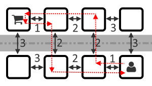

<h1 style='text-align: center;'> B. Laurenty and Shop</h1>

<h5 style='text-align: center;'>time limit per test: 1 second</h5>
<h5 style='text-align: center;'>memory limit per test: 256 megabytes</h5>

A little boy Laurenty has been playing his favourite game Nota for quite a while and is now very hungry. The boy wants to make sausage and cheese sandwiches, but first, he needs to buy a sausage and some cheese.

The town where Laurenty lives in is not large. The houses in it are located in two rows, *n* houses in each row. Laurenty lives in the very last house of the second row. The only shop in town is placed in the first house of the first row.

The first and second rows are separated with the main avenue of the city. The adjacent houses of one row are separated by streets.

Each crosswalk of a street or an avenue has some traffic lights. In order to cross the street, you need to press a button on the traffic light, wait for a while for the green light and cross the street. Different traffic lights can have different waiting time.

The traffic light on the crosswalk from the *j*-th house of the *i*-th row to the (*j* + 1)-th house of the same row has waiting time equal to *a**ij* (1 ≤ *i* ≤ 2, 1 ≤ *j* ≤ *n* - 1). For the traffic light on the crossing from the *j*-th house of one row to the *j*-th house of another row the waiting time equals *b**j* (1 ≤ *j* ≤ *n*). The city doesn't have any other crossings.

The boy wants to get to the store, buy the products and go back. The main avenue of the city is wide enough, so the boy wants to cross it exactly once on the way to the store and exactly once on the way back home. The boy would get bored if he had to walk the same way again, so he wants the way home to be different from the way to the store in at least one crossing.

  Figure to the first sample. Help Laurenty determine the minimum total time he needs to wait at the crossroads.

## Input

The first line of the input contains integer *n* (2 ≤ *n* ≤ 50) — the number of houses in each row. 

Each of the next two lines contains *n* - 1 space-separated integer — values *a**ij* (1 ≤ *a**ij* ≤ 100). 

The last line contains *n* space-separated integers *b**j* (1 ≤ *b**j* ≤ 100).

## Output

Print a single integer — the least total time Laurenty needs to wait at the crossroads, given that he crosses the avenue only once both on his way to the store and on his way back home.

## Examples

## Input


```
4  
1 2 3  
3 2 1  
3 2 2 3  

```
## Output


```
12  

```
## Input


```
3  
1 2  
3 3  
2 1 3  

```
## Output


```
11  

```
## Input


```
2  
1  
1  
1 1  

```
## Output


```
4  

```
## Note

The first sample is shown on the figure above. 

In the second sample, Laurenty's path can look as follows: 

* Laurenty crosses the avenue, the waiting time is 3;
* Laurenty uses the second crossing in the first row, the waiting time is 2;
* Laurenty uses the first crossing in the first row, the waiting time is 1;
* Laurenty uses the first crossing in the first row, the waiting time is 1;
* Laurenty crosses the avenue, the waiting time is 1;
* Laurenty uses the second crossing in the second row, the waiting time is 3.

 In total we get that the answer equals 11.In the last sample Laurenty visits all the crossings, so the answer is 4.


#### tags 

#1300 #implementation 