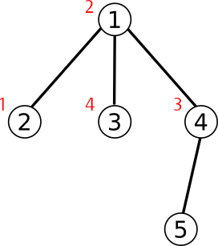

<h1 style='text-align: center;'> C. Duff in the Army</h1>

<h5 style='text-align: center;'>time limit per test: 4 seconds</h5>
<h5 style='text-align: center;'>memory limit per test: 512 megabytes</h5>

Recently Duff has been a soldier in the army. Malek is her commander.

Their country, Andarz Gu has *n* cities (numbered from 1 to *n*) and *n* - 1 bidirectional roads. Each road connects two different cities. There exist a unique path between any two cities.

There are also *m* people living in Andarz Gu (numbered from 1 to *m*). Each person has and ID number. ID number of *i* - *th* person is *i* and he/she lives in city number *c**i*. ## Note

 that there may be more than one person in a city, also there may be no people living in the city.

  Malek loves to order. That's why he asks Duff to answer to *q* queries. In each query, he gives her numbers *v*, *u* and *a*.

To answer a query:

Assume there are *x* people living in the cities lying on the path from city *v* to city *u*. Assume these people's IDs are *p*1, *p*2, ..., *p**x* in increasing order. 

If *k* = *min*(*x*, *a*), then Duff should tell Malek numbers *k*, *p*1, *p*2, ..., *p**k* in this order. In the other words, Malek wants to know *a* minimums on that path (or less, if there are less than *a* people).

Duff is very busy at the moment, so she asked you to help her and answer the queries.

## Input

The first line of input contains three integers, *n*, *m* and *q* (1 ≤ *n*, *m*, *q* ≤ 105).

The next *n* - 1 lines contain the roads. Each line contains two integers *v* and *u*, endpoints of a road (1 ≤ *v*, *u* ≤ *n*, *v* ≠ *u*).

Next line contains *m* integers *c*1, *c*2, ..., *c**m* separated by spaces (1 ≤ *c**i* ≤ *n* for each 1 ≤ *i* ≤ *m*).

Next *q* lines contain the queries. Each of them contains three integers, *v*, *u* and *a* (1 ≤ *v*, *u* ≤ *n* and 1 ≤ *a* ≤ 10).

## Output

For each query, print numbers *k*, *p*1, *p*2, ..., *p**k* separated by spaces in one line.

## Examples

## Input


```
5 4 5  
1 3  
1 2  
1 4  
4 5  
2 1 4 3  
4 5 6  
1 5 2  
5 5 10  
2 3 3  
5 3 1  

```
## Output


```
1 3  
2 2 3  
0  
3 1 2 4  
1 2  

```
## Note

Graph of Andarz Gu in the sample case is as follows (ID of people in each city are written next to them):

  

#### tags 

#2200 #data_structures #trees 