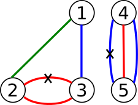

<h1 style='text-align: center;'> D. Duff in Mafia</h1>

<h5 style='text-align: center;'>time limit per test: 6 seconds</h5>
<h5 style='text-align: center;'>memory limit per test: 256 megabytes</h5>

Duff is one if the heads of Mafia in her country, Andarz Gu. Andarz Gu has *n* cities (numbered from 1 to *n*) connected by *m* bidirectional roads (numbered by 1 to *m*).

Each road has a destructing time, and a color. *i*-th road connects cities *v**i* and *u**i* and its color is *c**i* and its destructing time is *t**i*.

Mafia wants to destruct a matching in Andarz Gu. A matching is a subset of roads such that no two roads in this subset has common endpoint. They can destruct these roads in parallel, i. e. the total destruction time is a maximum over destruction times of all selected roads.

  They want two conditions to be satisfied:

1. The remaining roads form a proper coloring.
2. Destructing time of this matching is minimized.

The remaining roads after destructing this matching form a proper coloring if and only if no two roads of the same color have same endpoint, or, in the other words, edges of each color should form a matching.

There is no programmer in Mafia. That's why Duff asked for your help. Please help her and determine which matching to destruct in order to satisfied those conditions (or state that this is not possible).

## Input

The first line of input contains two integers *n* and *m* (2 ≤ *n* ≤ 5 × 104 and 1 ≤ *m* ≤ 5 × 104), number of cities and number of roads in the country.

The next *m* lines contain the the roads. *i* - *th* of them contains four integers *v**i*, *u**i*, *c**i* and *t**i* (1 ≤ *v**i*, *u**i* ≤ *n*, *v**i* ≠ *u**i* and 1 ≤ *c**i*, *t**i* ≤ 109 for each 1 ≤ *i* ≤ *m*).

## Output

In the first line of input, print "Yes" (without quotes) if satisfying the first condition is possible and "No" (without quotes) otherwise.

If it is possible, then you have to print two integers *t* and *k* in the second line, the minimum destructing time and the number of roads in the matching ().

In the third line print *k* distinct integers separated by spaces, indices of the roads in the matching in any order. Roads are numbered starting from one in order of their appearance in the input.

If there's more than one solution, print any of them.

## Examples

## Input


```
5 7  
2 1 3 7  
3 1 1 6  
5 4 1 8  
4 5 1 1  
3 2 2 3  
4 5 2 5  
2 3 2 4  

```
## Output


```
Yes  
3 2  
4 5  

```
## Input


```
3 5  
3 2 1 3  
1 3 1 1  
3 2 1 4  
1 3 2 2  
1 3 2 10  

```
## Output


```
No  

```
## Note

Graph of Andarz Gu in the first sample case is as follows:

  A solution would be to destruct the roads with crosses.

Graph of Andarz Gu in the second sample case is as follows:

  

#### tags 

#3100 #2-sat #binary_search 