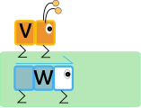

<h1 style='text-align: center;'> C. The Big Race</h1>

<h5 style='text-align: center;'>time limit per test: 1 second</h5>
<h5 style='text-align: center;'>memory limit per test: 256 megabytes</h5>

Vector Willman and Array Bolt are the two most famous athletes of Byteforces. They are going to compete in a race with a distance of *L* meters today.

  Willman and Bolt have exactly the same speed, so when they compete the result is always a tie. That is a problem for the organizers because they want a winner. 

While watching previous races the organizers have noticed that Willman can perform only steps of length equal to *w* meters, and Bolt can perform only steps of length equal to *b* meters. Organizers decided to slightly change the rules of the race. Now, at the end of the racetrack there will be an abyss, and the winner will be declared the athlete, who manages to run farther from the starting point of the the racetrack (which is not the subject to change by any of the athletes). 

## Note

 that none of the athletes can run infinitely far, as they both will at some moment of time face the point, such that only one step further will cause them to fall in the abyss. In other words, the athlete will not fall into the abyss if the total length of all his steps will be less or equal to the chosen distance *L*.

Since the organizers are very fair, the are going to set the length of the racetrack as an integer chosen randomly and uniformly in range from 1 to *t* (both are included). What is the probability that Willman and Bolt tie again today?

## Input

The first line of the input contains three integers *t*, *w* and *b* (1 ≤ *t*, *w*, *b* ≤ 5·1018) — the maximum possible length of the racetrack, the length of Willman's steps and the length of Bolt's steps respectively.

## Output

Print the answer to the problem as an irreducible fraction . Follow the format of the samples output.

The fraction  (*p* and *q* are integers, and both *p* ≥ 0 and *q* > 0 holds) is called irreducible, if there is no such integer *d* > 1, that both *p* and *q* are divisible by *d*.

## Examples

## Input


```
10 3 2  

```
## Output


```
3/10  

```
## Input


```
7 1 2  

```
## Output


```
3/7  

```
## Note

In the first sample Willman and Bolt will tie in case 1, 6 or 7 are chosen as the length of the racetrack.


#### tags 

#1800 #math 