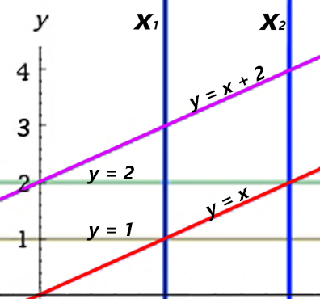

<h1 style='text-align: center;'> B. Anton and Lines</h1>

<h5 style='text-align: center;'>time limit per test: 1 second</h5>
<h5 style='text-align: center;'>memory limit per test: 256 megabytes</h5>

The teacher gave Anton a large geometry homework, but he didn't do it (as usual) as he participated in a regular round on Codeforces. In the task he was given a set of *n* lines defined by the equations *y* = *k**i*·*x* + *b**i*. It was necessary to determine whether there is at least one point of intersection of two of these lines, that lays strictly inside the strip between *x*1 < *x*2. In other words, is it true that there are 1 ≤ *i* < *j* ≤ *n* and *x*', *y*', such that: 

* *y*' = *k**i* * *x*' + *b**i*, that is, point (*x*', *y*') belongs to the line number *i*;
* *y*' = *k**j* * *x*' + *b**j*, that is, point (*x*', *y*') belongs to the line number *j*;
* *x*1 < *x*' < *x*2, that is, point (*x*', *y*') lies inside the strip bounded by *x*1 < *x*2.

You can't leave Anton in trouble, can you? Write a program that solves the given task.

## Input

The first line of the input contains an integer *n* (2 ≤ *n* ≤ 100 000) — the number of lines in the task given to Anton. The second line contains integers *x*1 and *x*2 ( - 1 000 000 ≤ *x*1 < *x*2 ≤ 1 000 000) defining the strip inside which you need to find a point of intersection of at least two lines.

The following *n* lines contain integers *k**i*, *b**i* ( - 1 000 000 ≤ *k**i*, *b**i* ≤ 1 000 000) — the descriptions of the lines. It is guaranteed that all lines are pairwise distinct, that is, for any two *i* ≠ *j* it is true that either *k**i* ≠ *k**j*, or *b**i* ≠ *b**j*.

## Output

Print "Yes" (without quotes), if there is at least one intersection of two distinct lines, located strictly inside the strip. Otherwise print "No" (without quotes).

## Examples

## Input


```
4  
1 2  
1 2  
1 0  
0 1  
0 2  

```
## Output


```
NO
```
## Input


```
2  
1 3  
1 0  
-1 3  

```
## Output


```
YES
```
## Input


```
2  
1 3  
1 0  
0 2  

```
## Output


```
YES
```
## Input


```
2  
1 3  
1 0  
0 3  

```
## Output


```
NO
```
## Note

In the first sample there are intersections located on the border of the strip, but there are no intersections located strictly inside it.

  

#### tags 

#1600 #geometry #sortings 