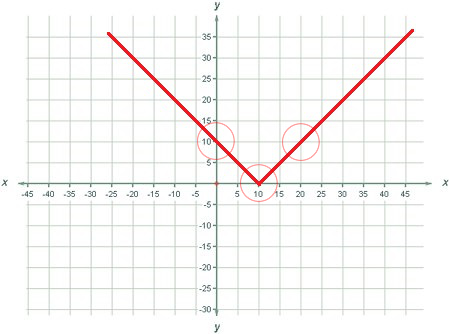

<h1 style='text-align: center;'> C. Beautiful Function</h1>

<h5 style='text-align: center;'>time limit per test: 2 seconds</h5>
<h5 style='text-align: center;'>memory limit per test: 256 megabytes</h5>

Every day Ruslan tried to count sheep to fall asleep, but this didn't help. Now he has found a more interesting thing to do. First, he thinks of some set of circles on a plane, and then tries to choose a beautiful set of points, such that there is at least one point from the set inside or on the border of each of the imagined circles.

Yesterday Ruslan tried to solve this problem for the case when the set of points is considered beautiful if it is given as (*x**t* = *f*(*t*), *y**t* = *g*(*t*)), where argument *t* takes all integer values from 0 to 50. Moreover, *f*(*t*) and *g*(*t*) should be correct functions.

Assume that *w*(*t*) and *h*(*t*) are some correct functions, and *c* is an integer ranging from 0 to 50. The function *s*(*t*) is correct if it's obtained by one of the following rules: 

1. *s*(*t*) = *abs*(*w*(*t*)), where *abs*(*x*) means taking the absolute value of a number *x*, i.e. |*x*|;
2. *s*(*t*) = (*w*(*t*) + *h*(*t*));
3. *s*(*t*) = (*w*(*t*) - *h*(*t*));
4. *s*(*t*) = (*w*(*t*) * *h*(*t*)), where  *  means multiplication, i.e. (*w*(*t*)·*h*(*t*));
5. *s*(*t*) = *c*;
6. *s*(*t*) = *t*;

Yesterday Ruslan thought on and on, but he could not cope with the task. Now he asks you to write a program that computes the appropriate *f*(*t*) and *g*(*t*) for any set of at most 50 circles.

In each of the functions *f*(*t*) and *g*(*t*) you are allowed to use no more than 50 multiplications. The length of any function should not exceed 100·*n* characters. The function should not contain spaces.

Ruslan can't keep big numbers in his memory, so you should choose *f*(*t*) and *g*(*t*), such that for all integer *t* from 0 to 50 value of *f*(*t*) and *g*(*t*) and all the intermediate calculations won't exceed 109 by their absolute value.

## Input

The first line of the input contains number *n* (1 ≤ *n* ≤ 50) — the number of circles Ruslan thinks of. Next follow *n* lines, each of them containing three integers *x**i*, *y**i* and *r**i* (0 ≤ *x**i*, *y**i* ≤ 50, 2 ≤ *r**i* ≤ 50) — the coordinates of the center and the raduis of the *i*-th circle.

## Output

In the first line print a correct function *f*(*t*). In the second line print a correct function *g*(*t*). The set of the points (*x**t* = *f*(*t*), *y**t* = *g*(*t*)) (0 ≤ *t* ≤ 50) must satisfy the condition, that there is at least one point inside or on the border of each of the circles, Ruslan thinks of at the beginning.

## Examples

## Input


```
3  
0 10 4  
10 0 4  
20 10 4  

```
## Output


```
t   
abs((t-10))
```
## Note

Correct functions:

1. 10
2. (1+2)
3. ((*t*-3)+(*t**4))
4. *abs*((*t*-10))
5. (*abs*((((23-*t*)*(*t***t*))+((45+12)*(*t***t*))))*((5**t*)+((12**t*)-13)))
6. *abs*((*t*-(*abs*((*t**31))+14))))

Incorrect functions:

1. 3+5+7 (not enough brackets, it should be ((3+5)+7) or (3+(5+7)))
2. *abs*(*t*-3) (not enough brackets, it should be *abs*((*t*-3))
3. 2+(2-3 (one bracket too many)
4. 1(*t*+5) (no arithmetic operation between 1 and the bracket)
5. 5000*5000 (the number exceeds the maximum)

  The picture shows one of the possible solutions

#### tags 

#2200 #constructive_algorithms #math 