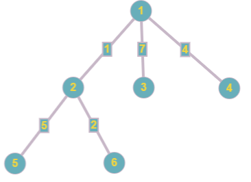
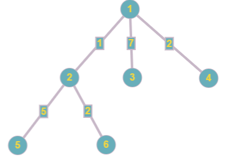
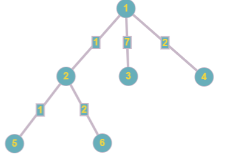

<h1 style='text-align: center;'> D. Happy Tree Party</h1>

<h5 style='text-align: center;'>time limit per test: 3 seconds</h5>
<h5 style='text-align: center;'>memory limit per test: 256 megabytes</h5>

Bogdan has a birthday today and mom gave him a tree consisting of *n* vertecies. For every edge of the tree *i*, some number *x**i* was written on it. In case you forget, a tree is a connected non-directed graph without cycles. After the present was granted, *m* guests consecutively come to Bogdan's party. When the *i*-th guest comes, he performs exactly one of the two possible operations: 

1. Chooses some number *y**i*, and two vertecies *a**i* and *b**i*. After that, he moves along the edges of the tree from vertex *a**i* to vertex *b**i* using the shortest path (of course, such a path is unique in the tree). Every time he moves along some edge *j*, he replaces his current number *y**i* by , that is, by the result of integer division *y**i* div *x**j*.
2. Chooses some edge *p**i* and replaces the value written in it *x**p**i* by some positive integer *c**i* < *x**p**i*.

As Bogdan cares about his guests, he decided to ease the process. Write a program that performs all the operations requested by guests and outputs the resulting value *y**i* for each *i* of the first type.

## Input

The first line of the input contains integers, *n* and *m* (2 ≤ *n* ≤ 200 000, 1 ≤ *m* ≤ 200 000) — the number of vertecies in the tree granted to Bogdan by his mom and the number of guests that came to the party respectively.

Next *n* - 1 lines contain the description of the edges. The *i*-th of these lines contains three integers *u**i*, *v**i* and *x**i* (1 ≤ *u**i*, *v**i* ≤ *n*, *u**i* ≠ *v**i*, 1 ≤ *x**i* ≤ 1018), denoting an edge that connects vertecies *u**i* and *v**i*, with the number *x**i* initially written on it.

The following *m* lines describe operations, requested by Bogdan's guests. Each description contains three or four integers and has one of the two possible forms: 

* 1 *a**i* *b**i* *y**i* corresponds to a guest, who chooses the operation of the first type.
* 2 *p**i* *c**i* corresponds to a guests, who chooses the operation of the second type.

 It is guaranteed that all the queries are correct, namely 1 ≤ *a**i*, *b**i* ≤ *n*, 1 ≤ *p**i* ≤ *n* - 1, 1 ≤ *y**i* ≤ 1018 and 1 ≤ *c**i* < *x**p**i*, where *x**p**i* represents a number written on edge *p**i* at this particular moment of time that is not necessarily equal to the initial value *x**p**i*, as some decreases may have already been applied to it. The edges are numbered from 1 to *n* - 1 in the order they appear in the input.## Output

For each guest who chooses the operation of the first type, print the result of processing the value *y**i* through the path from *a**i* to *b**i*.

## Examples

## Input


```
6 6  
1 2 1  
1 3 7  
1 4 4  
2 5 5  
2 6 2  
1 4 6 17  
2 3 2  
1 4 6 17  
1 5 5 20  
2 4 1  
1 5 1 3  

```
## Output


```
2  
4  
20  
3  

```
## Input


```
5 4  
1 2 7  
1 3 3  
3 4 2  
3 5 5  
1 4 2 100  
1 5 4 1  
2 2 2  
1 1 3 4  

```
## Output


```
2  
0  
2  

```
## Note

Initially the tree looks like this: 

  The response to the first query is:  = 2

After the third edge is changed, the tree looks like this: 

  The response to the second query is:  = 4

In the third query the initial and final vertex coincide, that is, the answer will be the initial number 20.

After the change in the fourth edge the tree looks like this: 

  In the last query the answer will be:  = 3


#### tags 

#2400 #data_structures #dfs_and_similar #graphs #math #trees 