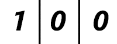
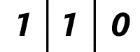
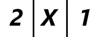
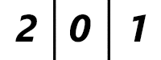
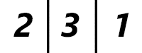
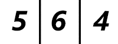

<h1 style='text-align: center;'> E. Strange Calculation and Cats</h1>

<h5 style='text-align: center;'>time limit per test: 4 seconds</h5>
<h5 style='text-align: center;'>memory limit per test: 256 megabytes</h5>

Gosha's universe is a table consisting of *n* rows and *m* columns. Both the rows and columns are numbered with consecutive integers starting with 1. We will use (*r*, *c*) to denote a cell located in the row *r* and column *c*.

Gosha is often invited somewhere. Every time he gets an invitation, he first calculates the number of ways to get to this place, and only then he goes. Gosha's house is located in the cell (1, 1).

At any moment of time, Gosha moves from the cell he is currently located in to a cell adjacent to it (two cells are adjacent if they share a common side). Of course, the movement is possible only if such a cell exists, i.e. Gosha will not go beyond the boundaries of the table. Thus, from the cell (*r*, *c*) he is able to make a move to one of the cells (*r* - 1, *c*), (*r*, *c* - 1), (*r* + 1, *c*), (*r*, *c* + 1). Also, Ghosha can skip a move and stay in the current cell (*r*, *c*).

Besides the love of strange calculations, Gosha is allergic to cats, so he never goes to the cell that has a cat in it. Gosha knows exactly where and when he will be invited and the schedule of cats travelling along the table. Formally, he has *q* records, the *i*-th of them has one of the following forms: 

* 1, *x**i*, *y**i*, *t**i* — Gosha is invited to come to cell (*x**i*, *y**i*) at the moment of time *t**i*. It is guaranteed that there is no cat inside cell (*x**i*, *y**i*) at this moment of time.
* 2, *x**i*, *y**i*, *t**i* — at the moment *t**i* a cat appears in cell (*x**i*, *y**i*). It is guaranteed that no other cat is located in this cell (*x**i*, *y**i*) at that moment of time.
* 3, *x**i*, *y**i*, *t**i* — at the moment *t**i* a cat leaves cell (*x**i*, *y**i*). It is guaranteed that there is cat located in the cell (*x**i*, *y**i*).

Gosha plans to accept only one invitation, but he has not yet decided, which particular one. In order to make this decision, he asks you to calculate for each of the invitations *i* the number of ways to get to the cell (*x**i*, *y**i*) at the moment *t**i*. For every invitation, assume that Gosha he starts moving from cell (1, 1) at the moment 1.

Moving between two neighboring cells takes Gosha exactly one unit of tim. In particular, this means that Gosha can come into the cell only if a cat sitting in it leaves the moment when Gosha begins his movement from the neighboring cell, and if none of the cats comes to the cell at the time when Gosha is in it.

Two ways to go from cell (1, 1) to cell (*x*, *y*) at time *t* are considered distinct if for at least one moment of time from 1 to *t* Gosha's positions are distinct for the two ways at this moment. ## Note

, that during this travel Gosha is allowed to visit both (1, 1) and (*x*, *y*) multiple times. Since the number of ways can be quite large, print it modulo 109 + 7.

## Input

The first line of the input contains three positive integers *n*, *m* and *q* (1 ≤ *n*·*m* ≤ 20, 1 ≤ *q* ≤ 10 000) — the number of rows and columns in the table and the number of events respectively.

Next *q* lines describe the events, each description contains four integers *tp**i*, *x**i*, *y**i* and *t**i* (1 ≤ *tp* ≤ 3, 1 ≤ *x* ≤ *n*, 1 ≤ *y* ≤ *m*, 2 ≤ *t* ≤ 109) — the type of the event (1 if Gosha gets an invitation, 2 if a cat comes to the cell and 3 if a cat leaves the cell), the coordinates of the cell where the action takes place and the moment of time at which the action takes place respectively.

It is guaranteed that the queries are given in the chronological order, i.e. *t**i* < *t**i* + 1. 

## Output

For each invitation *i* (that is, *tp**i* = 1) calculate the number of ways to get to cell (*x**i*, *y**i*) at the moment of time *t**i*. Respond to the invitations chronologically, that is, in the order they appear in the input.

## Examples

## Input


```
1 3 3  
2 1 2 3  
3 1 2 5  
1 1 1 7  

```
## Output


```
5  

```
## Input


```
3 3 3  
2 2 2 2  
1 3 3 5  
1 3 3 7  

```
## Output


```
2  
42  

```
## Input


```
4 5 5  
2 2 5 3  
2 2 4 6  
3 2 4 9  
1 4 4 13  
1 4 4 15  

```
## Output


```
490902  
10598759  

```
## Note

Explanation of the first sample. Each picture specifies the number of ways to arrive at the cell at the appropriate time. (X stands for a cell blocked at this particular moment of time)

  Time moment 1.   Time moment 2.  Time moment 3.  Time moment 4.  Time moment 5.  Time moment 6.  Time moment 7.

#### tags 

#2400 #dp #matrices 