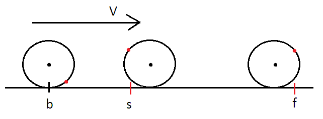

<h1 style='text-align: center;'> B. Max and Bike</h1>

<h5 style='text-align: center;'>time limit per test: 2 seconds</h5>
<h5 style='text-align: center;'>memory limit per test: 256 megabytes</h5>

For months Maxim has been coming to work on his favorite bicycle. And quite recently he decided that he is ready to take part in a cyclists' competitions.

He knows that this year *n* competitions will take place. During the *i*-th competition the participant must as quickly as possible complete a ride along a straight line from point *s**i* to point *f**i* (*s**i* < *f**i*).

Measuring time is a complex process related to usage of a special sensor and a time counter. Think of the front wheel of a bicycle as a circle of radius *r*. Let's neglect the thickness of a tire, the size of the sensor, and all physical effects. The sensor is placed on the rim of the wheel, that is, on some fixed point on a circle of radius *r*. After that the counter moves just like the chosen point of the circle, i.e. moves forward and rotates around the center of the circle.

At the beginning each participant can choose any point *b**i*, such that his bike is fully behind the starting line, that is, *b**i* < *s**i* - *r*. After that, he starts the movement, instantly accelerates to his maximum speed and at time *ts**i*, when the coordinate of the sensor is equal to the coordinate of the start, the time counter starts. The cyclist makes a complete ride, moving with his maximum speed and at the moment the sensor's coordinate is equal to the coordinate of the finish (moment of time *tf**i*), the time counter deactivates and records the final time. Thus, the counter records that the participant made a complete ride in time *tf**i* - *ts**i*.

  Maxim is good at math and he suspects that the total result doesn't only depend on his maximum speed *v*, but also on his choice of the initial point *b**i*. Now Maxim is asking you to calculate for each of *n* competitions the minimum possible time that can be measured by the time counter. The radius of the wheel of his bike is equal to *r*.

## Input

The first line contains three integers *n*, *r* and *v* (1 ≤ *n* ≤ 100 000, 1 ≤ *r*, *v* ≤ 109) — the number of competitions, the radius of the front wheel of Max's bike and his maximum speed, respectively. 

Next *n* lines contain the descriptions of the contests. The *i*-th line contains two integers *s**i* and *f**i* (1 ≤ *s**i* < *f**i* ≤ 109) — the coordinate of the start and the coordinate of the finish on the *i*-th competition.

## Output

Print *n* real numbers, the *i*-th number should be equal to the minimum possible time measured by the time counter. Your answer will be considered correct if its absolute or relative error will not exceed 10- 6. 

Namely: let's assume that your answer equals *a*, and the answer of the jury is *b*. The checker program will consider your answer correct if .

## Examples

## Input


```
2 1 2  
1 10  
5 9  

```
## Output


```
3.849644710502  
1.106060157705  

```


#### tags 

#2500 #binary_search #geometry 