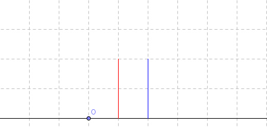

<h1 style='text-align: center;'> D. Wilbur and Trees</h1>

<h5 style='text-align: center;'>time limit per test: 2 seconds</h5>
<h5 style='text-align: center;'>memory limit per test: 256 megabytes</h5>

Wilbur the pig really wants to be a beaver, so he decided today to pretend he is a beaver and bite at trees to cut them down.

There are *n* trees located at various positions on a line. Tree *i* is located at position *x**i*. All the given positions of the trees are distinct.

The trees are equal, i.e. each tree has height *h*. Due to the wind, when a tree is cut down, it either falls left with probability *p*, or falls right with probability 1 - *p*. If a tree hits another tree while falling, that tree will fall in the same direction as the tree that hit it. A tree can hit another tree only if the distance between them is strictly less than *h*. 

For example, imagine there are 4 trees located at positions 1, 3, 5 and 8, while *h* = 3 and the tree at position 1 falls right. It hits the tree at position 3 and it starts to fall too. In it's turn it hits the tree at position 5 and it also starts to fall. The distance between 8 and 5 is exactly 3, so the tree at position 8 will not fall.

As long as there are still trees standing, Wilbur will select either the leftmost standing tree with probability 0.5 or the rightmost standing tree with probability 0.5. Selected tree is then cut down. If there is only one tree remaining, Wilbur always selects it. As the ground is covered with grass, Wilbur wants to know the expected total length of the ground covered with fallen trees after he cuts them all down because he is concerned about his grass-eating cow friends. Please help Wilbur.

## Input

The first line of the input contains two integers, *n* (1 ≤ *n* ≤ 2000) and *h* (1 ≤ *h* ≤ 108) and a real number *p* (0 ≤ *p* ≤ 1), given with no more than six decimal places.

The second line of the input contains *n* integers, *x*1, *x*2, ..., *x**n* ( - 108 ≤ *x**i* ≤ 108) in no particular order.

## Output

Print a single real number — the expected total length of the ground covered by trees when they have all fallen down. Your answer will be considered correct if its absolute or relative error does not exceed 10- 6. 

Namely: let's assume that your answer is *a*, and the answer of the jury is *b*. The checker program will consider your answer correct, if .

## Examples

## Input


```
2 2 0.500000  
1 2  

```
## Output


```
3.250000000  

```
## Input


```
4 3 0.4  
4 3 1 2  

```
## Output


```
6.631200000  

```
## Note

Consider the first example, we have 2 trees with height 2. 

   There are 3 scenarios:  1. Both trees falls left. This can either happen with the right tree falling left first, which has  probability (also knocking down the left tree), or the left tree can fall left and then the right tree can fall left, which has  probability. Total probability is . 

 2. Both trees fall right. This is analogous to (1), so the probability of this happening is . 

 3. The left tree fall left and the right tree falls right. This is the only remaining scenario so it must have  probability. 

 Cases 1 and 2 lead to a total of 3 units of ground covered, while case 3 leads to a total of 4 units of ground covered. Thus, the expected value is .


#### tags 

#2300 #dp #math #probabilities #sortings 