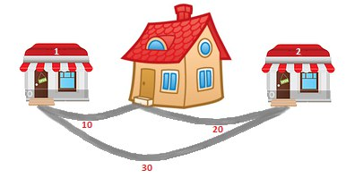

<h1 style='text-align: center;'> A. Patrick and Shopping</h1>

<h5 style='text-align: center;'>time limit per test: 1 second</h5>
<h5 style='text-align: center;'>memory limit per test: 256 megabytes</h5>

Today Patrick waits for a visit from his friend Spongebob. To prepare for the visit, Patrick needs to buy some goodies in two stores located near his house. There is a *d*1 meter long road between his house and the first shop and a *d*2 meter long road between his house and the second shop. Also, there is a road of length *d*3 directly connecting these two shops to each other. Help Patrick calculate the minimum distance that he needs to walk in order to go to both shops and return to his house.

  Patrick always starts at his house. He should visit both shops moving only along the three existing roads and return back to his house. He doesn't mind visiting the same shop or passing the same road multiple times. The only goal is to minimize the total distance traveled.

## Input

The first line of the input contains three integers *d*1, *d*2, *d*3 (1 ≤ *d*1, *d*2, *d*3 ≤ 108) — the lengths of the paths. 

* *d*1 is the length of the path connecting Patrick's house and the first shop;
* *d*2 is the length of the path connecting Patrick's house and the second shop;
* *d*3 is the length of the path connecting both shops.
## Output

Print the minimum distance that Patrick will have to walk in order to visit both shops and return to his house.

## Examples

## Input


```
10 20 30  

```
## Output


```
60  

```
## Input


```
1 1 5  

```
## Output


```
4  

```
## Note

The first sample is shown on the picture in the problem statement. One of the optimal routes is: house  first shop  second shop  house.

In the second sample one of the optimal routes is: house  first shop  house  second shop  house.


#### tags 

#800 #implementation 