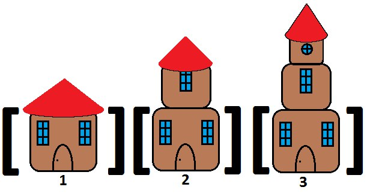
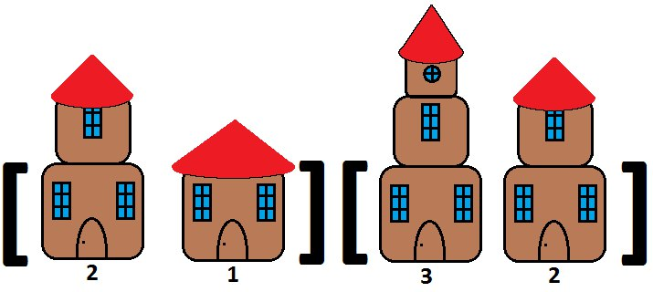

<h1 style='text-align: center;'> C. Day at the Beach</h1>

<h5 style='text-align: center;'>time limit per test: 2 seconds</h5>
<h5 style='text-align: center;'>memory limit per test: 256 megabytes</h5>

One day Squidward, Spongebob and Patrick decided to go to the beach. Unfortunately, the weather was bad, so the friends were unable to ride waves. However, they decided to spent their time building sand castles.

At the end of the day there were *n* castles built by friends. Castles are numbered from 1 to *n*, and the height of the *i*-th castle is equal to *h**i*. When friends were about to leave, Squidward noticed, that castles are not ordered by their height, and this looks ugly. Now friends are going to reorder the castles in a way to obtain that condition *h**i* ≤ *h**i* + 1 holds for all *i* from 1 to *n* - 1.

Squidward suggested the following process of sorting castles: 

* Castles are split into blocks — groups of consecutive castles. Therefore the block from *i* to *j* will include castles *i*, *i* + 1, ..., *j*. A block may consist of a single castle.
* The partitioning is chosen in such a way that every castle is a part of exactly one block.
* Each block is sorted independently from other blocks, that is the sequence *h**i*, *h**i* + 1, ..., *h**j* becomes sorted.
* The partitioning should satisfy the condition that after each block is sorted, the sequence *h**i* becomes sorted too. This may always be achieved by saying that the whole sequence is a single block.

Even Patrick understands that increasing the number of blocks in partitioning will ease the sorting process. Now friends ask you to count the maximum possible number of blocks in a partitioning that satisfies all the above requirements.

## Input

The first line of the input contains a single integer *n* (1 ≤ *n* ≤ 100 000) — the number of castles Spongebob, Patrick and Squidward made from sand during the day.

The next line contains *n* integers *h**i* (1 ≤ *h**i* ≤ 109). The *i*-th of these integers corresponds to the height of the *i*-th castle.

## Output

Print the maximum possible number of blocks in a valid partitioning.

## Examples

## Input


```
3  
1 2 3  

```
## Output


```
3  

```
## Input


```
4  
2 1 3 2  

```
## Output


```
2  

```
## Note

In the first sample the partitioning looks like that: [1][2][3].

  In the second sample the partitioning is: [2, 1][3, 2]

  

#### tags 

#1600 #sortings 