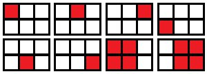

<h1 style='text-align: center;'> D. Spongebob and Squares</h1>

<h5 style='text-align: center;'>time limit per test: 2 seconds</h5>
<h5 style='text-align: center;'>memory limit per test: 256 megabytes</h5>

Spongebob is already tired trying to reason his weird actions and calculations, so he simply asked you to find all pairs of n and m, such that there are exactly *x* distinct squares in the table consisting of *n* rows and *m* columns. For example, in a 3 × 5 table there are 15 squares with side one, 8 squares with side two and 3 squares with side three. The total number of distinct squares in a 3 × 5 table is 15 + 8 + 3 = 26.

## Input

The first line of the input contains a single integer *x* (1 ≤ *x* ≤ 1018) — the number of squares inside the tables Spongebob is interested in.

## Output

First print a single integer *k* — the number of tables with exactly *x* distinct squares inside.

Then print *k* pairs of integers describing the tables. Print the pairs in the order of increasing *n*, and in case of equality — in the order of increasing *m*.

## Examples

## Input


```
26  

```
## Output


```
6  
1 26  
2 9  
3 5  
5 3  
9 2  
26 1  

```
## Input


```
2  

```
## Output


```
2  
1 2  
2 1  

```
## Input


```
8  

```
## Output


```
4  
1 8  
2 3  
3 2  
8 1  

```
## Note

In a 1 × 2 table there are 2 1 × 1 squares. So, 2 distinct squares in total.

  In a 2 × 3 table there are 6 1 × 1 squares and 2 2 × 2 squares. That is equal to 8 squares in total.

  

#### tags 

#1900 #brute_force #math 