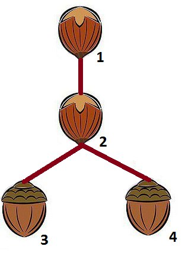
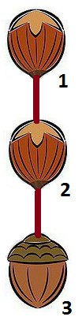
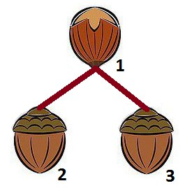

<h1 style='text-align: center;'> E. Sandy and Nuts</h1>

<h5 style='text-align: center;'>time limit per test: 3 seconds</h5>
<h5 style='text-align: center;'>memory limit per test: 256 megabytes</h5>

Rooted tree is a connected graph without any simple cycles with one vertex selected as a root. In this problem the vertex number 1 will always serve as a root.

Lowest common ancestor of two vertices *u* and *v* is the farthest from the root vertex that lies on both the path from *u* to the root and on path from *v* to the root. We will denote it as *LCA*(*u*, *v*).

Sandy had a rooted tree consisting of *n* vertices that she used to store her nuts. Unfortunately, the underwater storm broke her tree and she doesn't remember all it's edges. She only managed to restore *m* edges of the initial tree and *q* triples *a**i*, *b**i* and *c**i*, for which she supposes *LCA*(*a**i*, *b**i*) = *c**i*.

Help Sandy count the number of trees of size *n* with vertex 1 as a root, that match all the information she remembered. If she made a mess and there are no such trees then print 0. Two rooted trees are considered to be distinct if there exists an edge that occur in one of them and doesn't occur in the other one.

## Input

The first line of the input contains three integers *n*, *m* and *q* (1 ≤ *n* ≤ 13, 0 ≤ *m* < *n*, 0 ≤ *q* ≤ 100) — the number of vertices, the number of edges and *LCA* triples remembered by Sandy respectively.

Each of the next *m* lines contains two integers *u**i* and *v**i* (1 ≤ *u**i*, *v**i* ≤ *n*, *u**i* ≠ *v**i*) — the numbers of vertices connected by the *i*-th edge. It's guaranteed that this set of edges is a subset of edges of some tree.

The last *q* lines contain the triplets of numbers *a**i*, *b**i*, *c**i* (1 ≤ *a**i*, *b**i*, *c**i* ≤ *n*). Each of these triples define *LCA*(*a**i*, *b**i*) = *c**i*. It's not guaranteed that there exists a tree that satisfy all the given *LCA* conditions.

## Output

Print a single integer — the number of trees of size *n* that satisfy all the conditions.

## Examples

## Input


```
4 0 0  

```
## Output


```
16  

```
## Input


```
4 0 1  
3 4 2  

```
## Output


```
1  

```
## Input


```
3 1 0  
1 2  

```
## Output


```
2  

```
## Input


```
3 0 2  
2 3 2  
2 3 1  

```
## Output


```
0  

```
## Input


```
4 1 2  
1 2  
2 2 2  
3 4 2  

```
## Output


```
1  

```
## Note

In the second sample correct answer looks like this:

  In the third sample there are two possible trees:

    In the fourth sample the answer is 0 because the information about *LCA* is inconsistent.


#### tags 

#2600 #bitmasks #dp #trees 