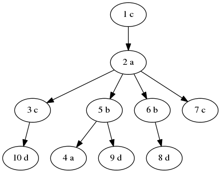
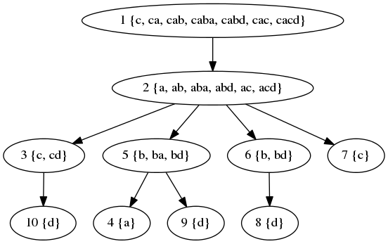
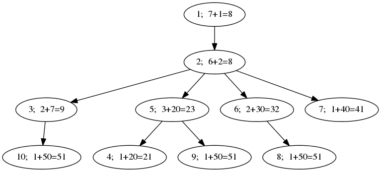

<h1 style='text-align: center;'> D. Acyclic Organic Compounds</h1>

<h5 style='text-align: center;'>time limit per test: 3 seconds</h5>
<h5 style='text-align: center;'>memory limit per test: 512 megabytes</h5>

You are given a tree *T* with *n* vertices (numbered 1 through *n*) and a letter in each vertex. The tree is rooted at vertex 1.

Let's look at the subtree *T**v* of some vertex *v*. It is possible to read a string along each simple path starting at *v* and ending at some vertex in *T**v* (possibly *v* itself). Let's denote the number of distinct strings which can be read this way as . 

Also, there's a number *c**v* assigned to each vertex *v*. We are interested in vertices with the maximum value of .

You should compute two statistics: the maximum value of  and the number of vertices *v* with the maximum .

## Input

The first line of the input contains one integer *n* (1 ≤ *n* ≤ 300 000) — the number of vertices of the tree.

The second line contains *n* space-separated integers *c**i* (0 ≤ *c**i* ≤ 109).

The third line contains a string *s* consisting of *n* lowercase English letters — the *i*-th character of this string is the letter in vertex *i*.

The following *n* - 1 lines describe the tree *T*. Each of them contains two space-separated integers *u* and *v* (1 ≤ *u*, *v* ≤ *n*) indicating an edge between vertices *u* and *v*.

It's guaranteed that the input will describe a tree.

## Output

Print two lines. 

On the first line, print  over all 1 ≤ *i* ≤ *n*. 

On the second line, print the number of vertices *v* for which .

## Examples

## Input


```
10  
1 2 7 20 20 30 40 50 50 50  
cacabbcddd  
1 2  
6 8  
7 2  
6 2  
5 4  
5 9  
3 10  
2 5  
2 3  

```
## Output


```
51  
3  

```
## Input


```
6  
0 2 4 1 1 1  
raaaba  
1 2  
2 3  
2 4  
2 5  
3 6  

```
## Output


```
6  
2  

```
## Note

In the first sample, the tree looks like this:

  The sets of strings that can be read from individual vertices are:

  Finally, the values of  are:

  In the second sample, the values of  are (5, 4, 2, 1, 1, 1). The distinct strings read in *T*2 are ; note that  can be read down to vertices 3 or 4.


#### tags 

#2400 #data_structures #dfs_and_similar #dsu #hashing #strings #trees 