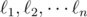
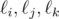
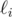

<h1 style='text-align: center;'> D. Ruminations on Ruminants</h1>

<h5 style='text-align: center;'>time limit per test: 4 seconds</h5>
<h5 style='text-align: center;'>memory limit per test: 256 megabytes</h5>

Kevin Sun is ruminating on the origin of cows while standing at the origin of the Cartesian plane. He notices *n* lines  on the plane, each representable by an equation of the form *ax* + *by* = *c*. He also observes that no two lines are parallel and that no three lines pass through the same point.

For each triple (*i*, *j*, *k*) such that 1 ≤ *i* < *j* < *k* ≤ *n*, Kevin considers the triangle formed by the three lines  . He calls a triangle original if the circumcircle of that triangle passes through the origin. Since Kevin believes that the circles of bovine life are tied directly to such triangles, he wants to know the number of original triangles formed by unordered triples of distinct lines. 

Recall that the circumcircle of a triangle is the circle which passes through all the vertices of that triangle.

## Input

The first line of the input contains a single integer *n* (3 ≤ *n* ≤ 2000), the number of lines.

The next *n* lines describe lines . The *i*-th of these lines contains three space-separated integers *a**i*, *b**i*, *c**i* (|*a**i*|, |*b**i*|, |*c**i*| ≤ 10 000, *a**i*2 + *b**i*2 > 0), representing the equation *a**i**x* + *b**i**y* = *c**i* of line .

## Output

Print a single integer, the number of triples (*i*, *j*, *k*) with *i* < *j* < *k* such that lines  form an original triangle.

## Examples

## Input


```
4  
1 0 0  
0 1 0  
1 1 -1  
1 -1 2  

```
## Output


```
2  

```
## Input


```
3  
0 1 1  
1 1 2  
1 -1 -2  

```
## Output


```
1  

```
## Note

## Note

 that in the first sample, some of the lines pass through the origin.

In the second sample, there is exactly one triple of lines: *y* = 1, *x* + *y* = 2, *x* - *y* =  - 2. The triangle they form has vertices (0, 2), (1, 1), ( - 1, 1). The circumcircle of this triangle has equation *x*2 + (*y* - 1)2 = 1. This indeed passes through (0, 0).


#### tags 

#2900 #geometry #math 