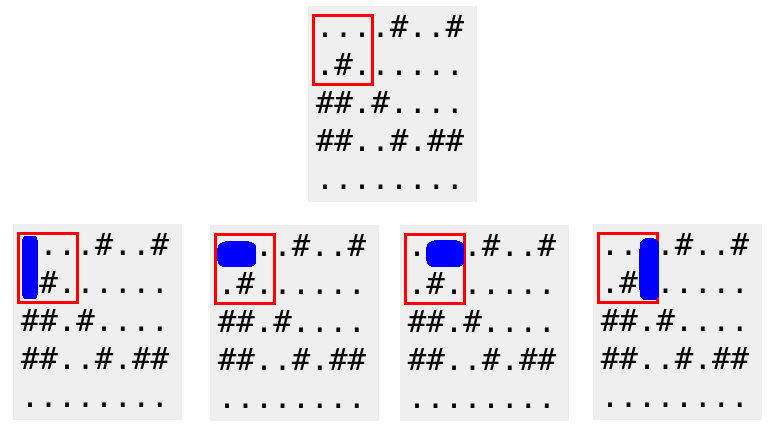

<h1 style='text-align: center;'> C. New Year and Domino</h1>

<h5 style='text-align: center;'>time limit per test: 3 seconds</h5>
<h5 style='text-align: center;'>memory limit per test: 256 megabytes</h5>

They say "years are like dominoes, tumbling one after the other". But would a year fit into a grid? I don't think so.

Limak is a little polar bear who loves to play. He has recently got a rectangular grid with *h* rows and *w* columns. Each cell is a square, either empty (denoted by '.') or forbidden (denoted by '#'). Rows are numbered 1 through *h* from top to bottom. Columns are numbered 1 through *w* from left to right.

Also, Limak has a single domino. He wants to put it somewhere in a grid. A domino will occupy exactly two adjacent cells, located either in one row or in one column. Both adjacent cells must be empty and must be inside a grid.

Limak needs more fun and thus he is going to consider some queries. In each query he chooses some rectangle and wonders, how many way are there to put a single domino inside of the chosen rectangle?

## Input

The first line of the input contains two integers *h* and *w* (1 ≤ *h*, *w* ≤ 500) – the number of rows and the number of columns, respectively.

The next *h* lines describe a grid. Each line contains a string of the length *w*. Each character is either '.' or '#' — denoting an empty or forbidden cell, respectively.

The next line contains a single integer *q* (1 ≤ *q* ≤ 100 000) — the number of queries.

Each of the next *q* lines contains four integers *r*1*i*, *c*1*i*, *r*2*i*, *c*2*i* (1 ≤ *r*1*i* ≤ *r*2*i* ≤ *h*, 1 ≤ *c*1*i* ≤ *c*2*i* ≤ *w*) — the *i*-th query. Numbers *r*1*i* and *c*1*i* denote the row and the column (respectively) of the upper left cell of the rectangle. Numbers *r*2*i* and *c*2*i* denote the row and the column (respectively) of the bottom right cell of the rectangle.

## Output

Print *q* integers, *i*-th should be equal to the number of ways to put a single domino inside the *i*-th rectangle.

## Examples

## Input


```
5 8  
....#..#  
.#......  
##.#....  
##..#.##  
........  
4  
1 1 2 3  
4 1 4 1  
1 2 4 5  
2 5 5 8  

```
## Output


```
4  
0  
10  
15  

```
## Input


```
7 39  
.......................................  
.###..###..#..###.....###..###..#..###.  
...#..#.#..#..#.........#..#.#..#..#...  
.###..#.#..#..###.....###..#.#..#..###.  
.#....#.#..#....#.....#....#.#..#..#.#.  
.###..###..#..###.....###..###..#..###.  
.......................................  
6  
1 1 3 20  
2 10 6 30  
2 10 7 30  
2 2 7 7  
1 7 7 7  
1 8 7 8  

```
## Output


```
53  
89  
120  
23  
0  
2  

```
## Note

A red frame below corresponds to the first query of the first sample. A domino can be placed in 4 possible ways.

  

#### tags 

#1500 #dp #implementation 