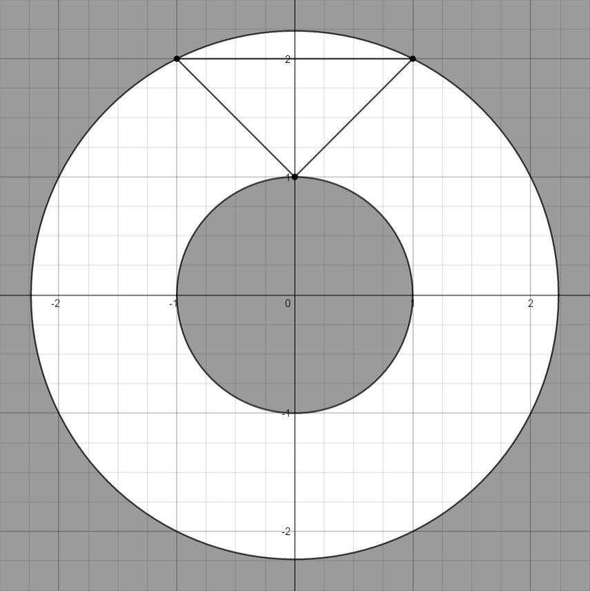

<h1 style='text-align: center;'> A. Peter and Snow Blower</h1>

<h5 style='text-align: center;'>time limit per test: 2 seconds</h5>
<h5 style='text-align: center;'>memory limit per test: 256 megabytes</h5>

Peter got a new snow blower as a New Year present. Of course, Peter decided to try it immediately. After reading the instructions he realized that it does not work like regular snow blowing machines. In order to make it work, you need to tie it to some point that it does not cover, and then switch it on. As a result it will go along a circle around this point and will remove all the snow from its path.

Formally, we assume that Peter's machine is a polygon on a plane. Then, after the machine is switched on, it will make a circle around the point to which Peter tied it (this point lies strictly outside the polygon). That is, each of the points lying within or on the border of the polygon will move along the circular trajectory, with the center of the circle at the point to which Peter tied his machine.

Peter decided to tie his car to point *P* and now he is wondering what is the area of ​​the region that will be cleared from snow. Help him.

## Input

The first line of the input contains three integers — the number of vertices of the polygon *n* (), and coordinates of point *P*.

Each of the next *n* lines contains two integers — coordinates of the vertices of the polygon in the clockwise or counterclockwise order. It is guaranteed that no three consecutive vertices lie on a common straight line.

All the numbers in the input are integers that do not exceed 1 000 000 in their absolute value.

## Output

Print a single real value number — the area of the region that will be cleared. Your answer will be considered correct if its absolute or relative error does not exceed 10- 6. 

Namely: let's assume that your answer is *a*, and the answer of the jury is *b*. The checker program will consider your answer correct, if .

## Examples

## Input


```
3 0 0  
0 1  
-1 2  
1 2  

```
## Output


```
12.566370614359172464  

```
## Input


```
4 1 -1  
0 0  
1 2  
2 0  
1 1  

```
## Output


```
21.991148575128551812  

```
## Note

In the first sample snow will be removed from that area:

  

#### tags 

#1900 #binary_search #geometry #ternary_search 