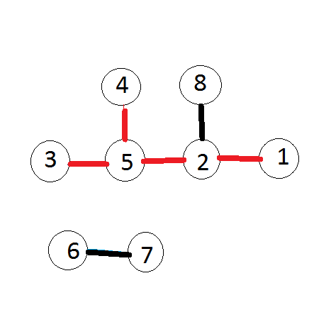

<h1 style='text-align: center;'> B. Longtail Hedgehog</h1>

<h5 style='text-align: center;'>time limit per test: 3 seconds</h5>
<h5 style='text-align: center;'>memory limit per test: 256 megabytes</h5>

This Christmas Santa gave Masha a magic picture and a pencil. The picture consists of *n* points connected by *m* segments (they might cross in any way, that doesn't matter). No two segments connect the same pair of points, and no segment connects the point to itself. Masha wants to color some segments in order paint a hedgehog. In Mashas mind every hedgehog consists of a tail and some spines. She wants to paint the tail that satisfies the following conditions: 

1. Only segments already presented on the picture can be painted;
2. The tail should be continuous, i.e. consists of some sequence of points, such that every two neighbouring points are connected by a colored segment;
3. The numbers of points from the beginning of the tail to the end should strictly increase.

Masha defines the length of the tail as the number of points in it. Also, she wants to paint some spines. To do so, Masha will paint all the segments, such that one of their ends is the endpoint of the tail. Masha defines the beauty of a hedgehog as the length of the tail multiplied by the number of spines. Masha wants to color the most beautiful hedgehog. Help her calculate what result she may hope to get.

## Note

 that according to Masha's definition of a hedgehog, one segment may simultaneously serve as a spine and a part of the tail (she is a little girl after all). Take a look at the picture for further clarifications.

## Input

First line of the input contains two integers *n* and *m*(2 ≤ *n* ≤ 100 000, 1 ≤ *m* ≤ 200 000) — the number of points and the number segments on the picture respectively. 

Then follow *m* lines, each containing two integers *u**i* and *v**i* (1 ≤ *u**i*, *v**i* ≤ *n*, *u**i* ≠ *v**i*) — the numbers of points connected by corresponding segment. It's guaranteed that no two segments connect the same pair of points.

## Output

Print the maximum possible value of the hedgehog's beauty.

## Examples

## Input


```
8 6  
4 5  
3 5  
2 5  
1 2  
2 8  
6 7  

```
## Output


```
9  

```
## Input


```
4 6  
1 2  
1 3  
1 4  
2 3  
2 4  
3 4  

```
## Output


```
12  

```
## Note

The picture below corresponds to the first sample. Segments that form the hedgehog are painted red. The tail consists of a sequence of points with numbers 1, 2 and 5. The following segments are spines: (2, 5), (3, 5) and (4, 5). Therefore, the beauty of the hedgehog is equal to 3·3 = 9.




#### tags 

#1600 #dp #graphs 