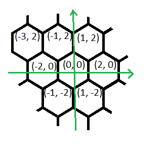
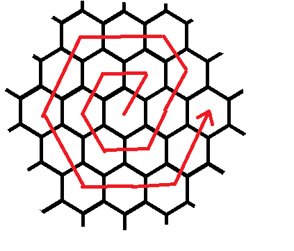

<h1 style='text-align: center;'> E. Hexagons</h1>

<h5 style='text-align: center;'>time limit per test: 1 second</h5>
<h5 style='text-align: center;'>memory limit per test: 256 megabytes</h5>

Ayrat is looking for the perfect code. He decided to start his search from an infinite field tiled by hexagons. For convenience the coordinate system is introduced, take a look at the picture to see how the coordinates of hexagon are defined: 

  Ayrat is searching through the field. He started at point (0, 0) and is moving along the spiral (see second picture). Sometimes he forgets where he is now. Help Ayrat determine his location after *n* moves.

## Input

The only line of the input contains integer *n* (0 ≤ *n* ≤ 1018) — the number of Ayrat's moves.

## Output

Print two integers *x* and *y* — current coordinates of Ayrat coordinates.

## Examples

## Input


```
3  

```
## Output


```
-2 0  

```
## Input


```
7  

```
## Output


```
3 2  

```


#### tags 

#2100 #binary_search #implementation #math 