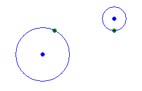
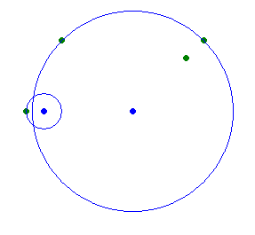

<h1 style='text-align: center;'> C. Watering Flowers</h1>

<h5 style='text-align: center;'>time limit per test: 2 seconds</h5>
<h5 style='text-align: center;'>memory limit per test: 256 megabytes</h5>

A flowerbed has many flowers and two fountains.

You can adjust the water pressure and set any values *r*1(*r*1 ≥ 0) and *r*2(*r*2 ≥ 0), giving the distances at which the water is spread from the first and second fountain respectively. You have to set such *r*1 and *r*2 that all the flowers are watered, that is, for each flower, the distance between the flower and the first fountain doesn't exceed *r*1, or the distance to the second fountain doesn't exceed *r*2. It's OK if some flowers are watered by both fountains.

You need to decrease the amount of water you need, that is set such *r*1 and *r*2 that all the flowers are watered and the *r*12 + *r*22 is minimum possible. Find this minimum value.

## Input

The first line of the input contains integers *n*, *x*1, *y*1, *x*2, *y*2 (1 ≤ *n* ≤ 2000,  - 107 ≤ *x*1, *y*1, *x*2, *y*2 ≤ 107) — the number of flowers, the coordinates of the first and the second fountain.

Next follow *n* lines. The *i*-th of these lines contains integers *x**i* and *y**i* ( - 107 ≤ *x**i*, *y**i* ≤ 107) — the coordinates of the *i*-th flower.

It is guaranteed that all *n* + 2 points in the input are distinct.

## Output

Print the minimum possible value *r*12 + *r*22. ## Note

, that in this problem optimal answer is always integer.

## Examples

## Input


```
2 -1 0 5 3  
0 2  
5 2  

```
## Output


```
6  

```
## Input


```
4 0 0 5 0  
9 4  
8 3  
-1 0  
1 4  

```
## Output


```
33  

```
## Note

The first sample is (*r*12 = 5, *r*22 = 1):  The second sample is (*r*12 = 1, *r*22 = 32): 


#### tags 

#1600 #implementation 