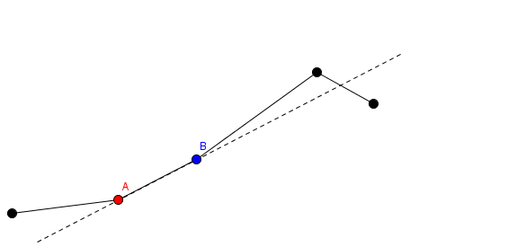
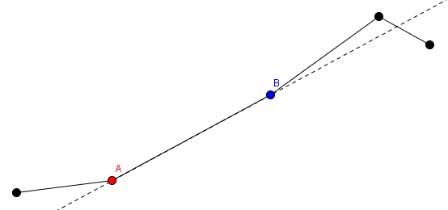
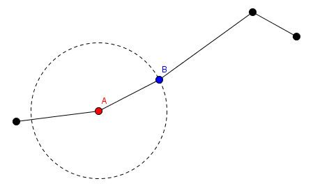
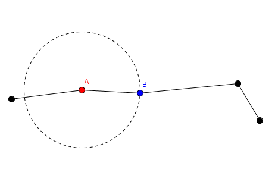
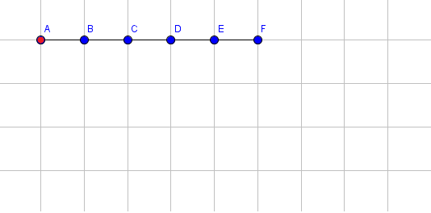
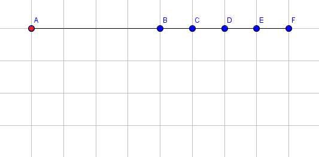
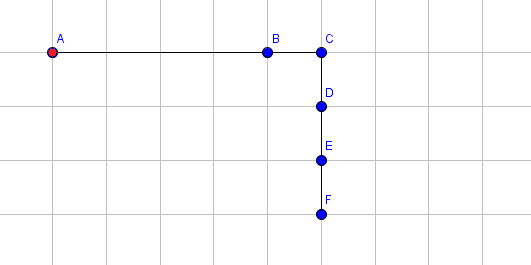
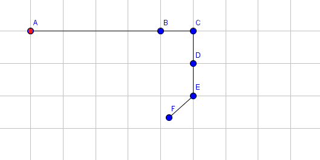
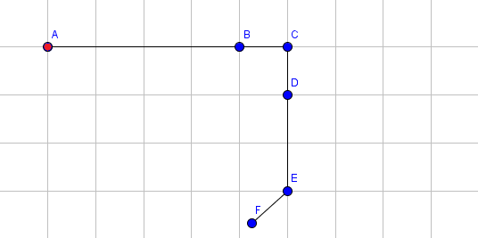

<h1 style='text-align: center;'> E. Robot Arm</h1>

<h5 style='text-align: center;'>time limit per test: 8 seconds</h5>
<h5 style='text-align: center;'>memory limit per test: 256 megabytes</h5>

Roger is a robot. He has an arm that is a series of *n* segments connected to each other. The endpoints of the *i*-th segment are initially located at points (*i* - 1, 0) and (*i*, 0). The endpoint at (*i* - 1, 0) is colored red and the endpoint at (*i*, 0) is colored blue for all segments. Thus, the blue endpoint of the *i*-th segment is touching the red endpoint of the (*i* + 1)-th segment for all valid *i*.

Roger can move his arm in two different ways: 

1. He can choose some segment and some value. This is denoted as choosing the segment number *i* and picking some positive *l*. This change happens as follows: the red endpoint of segment number *i* and segments from 1 to *i* - 1 are all fixed in place. Imagine a ray from the red endpoint to the blue endpoint. The blue endpoint and segments *i* + 1 through *n* are translated *l* units in the direction of this ray.   In this picture, the red point labeled *A* and segments before *A* stay in place, while the blue point labeled *B* and segments after *B* gets translated.
2. He can choose a segment and rotate it. This is denoted as choosing the segment number *i*, and an angle *a*. The red endpoint of the *i*-th segment will stay fixed in place. The blue endpoint of that segment and segments *i* + 1 to *n* will rotate clockwise by an angle of *a* degrees around the red endpoint.   In this picture, the red point labeled *A* and segments before *A* stay in place, while the blue point labeled *B* and segments after *B* get rotated around point *A*.

Roger will move his arm *m* times. These transformations are a bit complicated, and Roger easily loses track of where the blue endpoint of the last segment is. Help him compute the coordinates of the blue endpoint of the last segment after applying each operation. ## Note

 that these operations are cumulative, and Roger's arm may intersect itself arbitrarily during the moves.

## Input

The first line of the input will contain two integers *n* and *m* (1 ≤ *n*, *m* ≤ 300 000) — the number of segments and the number of operations to perform.

Each of the next *m* lines contains three integers *x**i*, *y**i* and *z**i* describing a move. If *x**i* = 1, this line describes a move of type 1, where *y**i* denotes the segment number and *z**i* denotes the increase in the length. If *x**i* = 2, this describes a move of type 2, where *y**i* denotes the segment number, and *z**i* denotes the angle in degrees. (1 ≤ *x**i* ≤ 2, 1 ≤ *y**i* ≤ *n*, 1 ≤ *z**i* ≤ 359)

## Output

Print *m* lines. The *i*-th line should contain two real values, denoting the coordinates of the blue endpoint of the last segment after applying operations 1, ..., *i*. Your answer will be considered correct if its absolute or relative error does not exceed 10- 4.

Namely, let's assume that your answer for a particular value of a coordinate is *a* and the answer of the jury is *b*. The checker program will consider your answer correct if  for all coordinates.

## Examples

## Input


```
5 4  
1 1 3  
2 3 90  
2 5 48  
1 4 1  

```
## Output


```
8.0000000000 0.0000000000  
5.0000000000 -3.0000000000  
4.2568551745 -2.6691306064  
4.2568551745 -3.6691306064  

```
## Note

The following pictures shows the state of the arm after each operation. The coordinates of point *F* are printed after applying each operation. For simplicity, we only show the blue endpoints of a segment (with the exception for the red endpoint of the first segment). For instance, the point labeled *B* is the blue endpoint for segment 1 and also the red endpoint for segment 2.

Initial state: 

   Extend segment 1 by 3.    Rotate segment 3 by 90 degrees clockwise.    Rotate segment 5 by 48 degrees clockwise.    Extend segment 4 by 1.   

#### tags 

#2500 #data_structures #geometry 