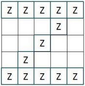

<h1 style='text-align: center;'> E. Zbazi in Zeydabad</h1>

<h5 style='text-align: center;'>time limit per test: 5 seconds</h5>
<h5 style='text-align: center;'>memory limit per test: 512 megabytes</h5>

A tourist wants to visit country Zeydabad for Zbazi (a local game in Zeydabad).

The country Zeydabad is a rectangular table consisting of *n* rows and *m* columns. Each cell on the country is either 'z' or '.'.

The tourist knows this country is named Zeydabad because there are lots of ''Z-pattern"s in the country. A ''Z-pattern" is a square which anti-diagonal is completely filled with 'z' and its upper and lower rows are also completely filled with 'z'. All other cells of a square can be arbitrary.

  Note that a ''Z-pattern" can consist of only one cell (see the examples).

So he wants to count the number of ''Z-pattern"s in the country (a necessary skill for Zbazi).

Now your task is to help tourist with counting number of ''Z-pattern"s.

As input/output can reach huge size it is recommended to use fast input/output methods: for example, prefer to use gets/scanf/printf instead of getline/cin/cout in C++, prefer to use BufferedReader/PrintWriter instead of Scanner/System.out in Java.

## Input

The first line contains two integers *n*, *m* (1 ≤ *n*, *m* ≤ 3000) — the number of rows and columns respectively.

Each of the next *n* lines contains *m* characters 'z' or '.' — the description of Zeydabad.

## Output

Print the only integer *a* — the number of ''Z-pattern"s in Zeydabad.

## Examples

## Input


```
4 4  
zzzz  
zzz.  
.z..  
zzzz  

```
## Output


```
16  

```
## Input


```
1 4  
z.z.  

```
## Output


```
2  

```
## Input


```
2 2  
zz  
zz  

```
## Output


```
5  

```


#### tags 

#2300 #data_structures #implementation 