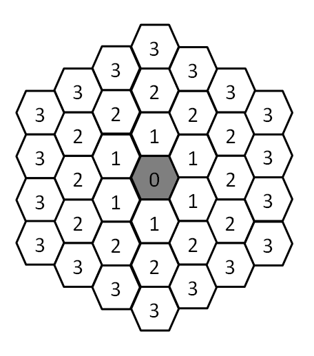

<h1 style='text-align: center;'> D. Hexagons!</h1>

<h5 style='text-align: center;'>time limit per test: 0.5 seconds</h5>
<h5 style='text-align: center;'>memory limit per test: 64 megabytes</h5>

After a probationary period in the game development company of IT City Petya was included in a group of the programmers that develops a new turn-based strategy game resembling the well known "Heroes of Might & Magic". A part of the game is turn-based fights of big squadrons of enemies on infinite fields where every cell is in form of a hexagon.

Some of magic effects are able to affect several field cells at once, cells that are situated not farther than *n* cells away from the cell in which the effect was applied. The distance between cells is the minimum number of cell border crosses on a path from one cell to another.

It is easy to see that the number of cells affected by a magic effect grows rapidly when *n* increases, so it can adversely affect the game performance. That's why Petya decided to write a program that can, given *n*, determine the number of cells that should be repainted after effect application, so that game designers can balance scale of the effects and the game performance. Help him to do it. Find the number of hexagons situated not farther than *n* cells away from a given cell.

  ## Input

The only line of the input contains one integer *n* (0 ≤ *n* ≤ 109).

## Output

## Output

 one integer — the number of hexagons situated not farther than *n* cells away from a given cell.

## Examples

## Input


```
2  

```
## Output


```
19
```


#### tags 

#1100 #math 