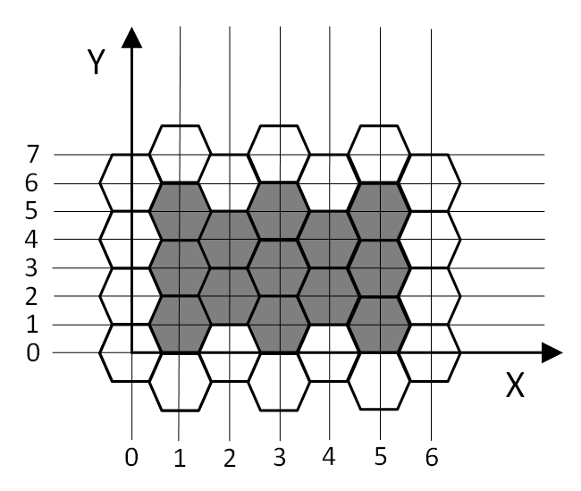

<h1 style='text-align: center;'> E. A rectangle</h1>

<h5 style='text-align: center;'>time limit per test: 0.5 seconds</h5>
<h5 style='text-align: center;'>memory limit per test: 64 megabytes</h5>

Developing tools for creation of locations maps for turn-based fights in a new game, Petya faced the following problem.

A field map consists of hexagonal cells. Since locations sizes are going to be big, a game designer wants to have a tool for quick filling of a field part with identical enemy units. This action will look like following: a game designer will select a rectangular area on the map, and each cell whose center belongs to the selected rectangle will be filled with the enemy unit.

More formally, if a game designer selected cells having coordinates (*x*1, *y*1) and (*x*2, *y*2), where *x*1 ≤ *x*2 and *y*1 ≤ *y*2, then all cells having center coordinates (*x*, *y*) such that *x*1 ≤ *x* ≤ *x*2 and *y*1 ≤ *y* ≤ *y*2 will be filled. Orthogonal coordinates system is set up so that one of cell sides is parallel to *OX* axis, all hexagon centers have integer coordinates and for each integer *x* there are cells having center with such *x* coordinate and for each integer *y* there are cells having center with such *y* coordinate. It is guaranteed that difference *x*2 - *x*1 is divisible by 2.

Working on the problem Petya decided that before painting selected units he wants to output number of units that will be painted on the map.

Help him implement counting of these units before painting.

  ## Input

The only line of input contains four integers *x*1, *y*1, *x*2, *y*2 ( - 109 ≤ *x*1 ≤ *x*2 ≤ 109,  - 109 ≤ *y*1 ≤ *y*2 ≤ 109) — the coordinates of the centers of two cells.

## Output

## Output

 one integer — the number of cells to be filled.

## Examples

## Input


```
1 1 5 5  

```
## Output


```
13
```


#### tags 

#1900 #math 