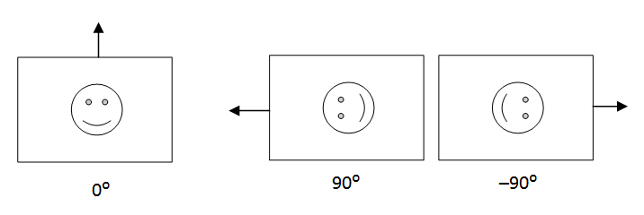
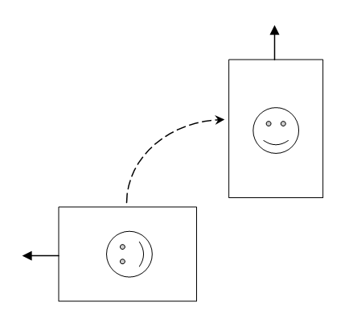

<h1 style='text-align: center;'> M. Turn</h1>

<h5 style='text-align: center;'>time limit per test: 0.5 seconds</h5>
<h5 style='text-align: center;'>memory limit per test: 64 megabytes</h5>

Vasya started working in a machine vision company of IT City. Vasya's team creates software and hardware for identification of people by their face.

One of the project's know-how is a camera rotating around its optical axis on shooting. People see an eye-catching gadget — a rotating camera — come up to it to see it better, look into it. And the camera takes their photo at that time. What could be better for high quality identification?

But not everything is so simple. The pictures from camera appear rotated too (on clockwise camera rotation frame the content becomes rotated counter-clockwise). But the identification algorithm can work only with faces that are just slightly deviated from vertical.

Vasya was entrusted to correct the situation — to rotate a captured image so that image would be minimally deviated from vertical. Requirements were severe. Firstly, the picture should be rotated only on angle divisible by 90 degrees to not lose a bit of information about the image. Secondly, the frames from the camera are so huge and FPS is so big that adequate rotation speed is provided by hardware FPGA solution only. And this solution can rotate only by 90 degrees clockwise. Of course, one can apply 90 degrees turn several times but for the sake of performance the number of turns should be minimized.

Help Vasya implement the program that by the given rotation angle of the camera can determine the minimum number of 90 degrees clockwise turns necessary to get a picture in which up direction deviation from vertical is minimum.

The next figure contains frames taken from an unrotated camera, then from rotated 90 degrees clockwise, then from rotated 90 degrees counter-clockwise. Arrows show direction to "true up".

  The next figure shows 90 degrees clockwise turn by FPGA hardware.

  ## Input

The only line of the input contains one integer *x* ( - 1018 ≤ *x* ≤ 1018) — camera angle in degrees. Positive value denotes clockwise camera rotation, negative — counter-clockwise.

## Output

## Output

 one integer — the minimum required number of 90 degrees clockwise turns.

## Examples

## Input


```
60  

```
## Output


```
1  

```
## Input


```
-60  

```
## Output


```
3  

```
## Note

When the camera is rotated 60 degrees counter-clockwise (the second example), an image from it is rotated 60 degrees clockwise. One 90 degrees clockwise turn of the image result in 150 degrees clockwise total rotation and deviation from "true up" for one turn is 150 degrees. Two 90 degrees clockwise turns of the image result in 240 degrees clockwise total rotation and deviation from "true up" for two turns is 120 degrees because 240 degrees clockwise equal to 120 degrees counter-clockwise. Three 90 degrees clockwise turns of the image result in 330 degrees clockwise total rotation and deviation from "true up" for three turns is 30 degrees because 330 degrees clockwise equal to 30 degrees counter-clockwise.

From 60, 150, 120 and 30 degrees deviations the smallest is 30, and it it achieved in three 90 degrees clockwise turns.


#### tags 

#1800 #geometry #math 