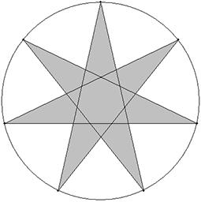

<h1 style='text-align: center;'> P. Area of a Star</h1>

<h5 style='text-align: center;'>time limit per test: 0.5 seconds</h5>
<h5 style='text-align: center;'>memory limit per test: 64 megabytes</h5>

It was decided in IT City to distinguish successes of local IT companies by awards in the form of stars covered with gold from one side. To order the stars it is necessary to estimate order cost that depends on the area of gold-plating. Write a program that can calculate the area of a star.

A "star" figure having *n* ≥ 5 corners where *n* is a prime number is constructed the following way. On the circle of radius *r* *n* points are selected so that the distances between the adjacent ones are equal. Then every point is connected by a segment with two maximally distant points. All areas bounded by the segments parts are the figure parts.

  ## Input

The only line of the input contains two integers *n* (5 ≤ *n* < 109, *n* is prime) and *r* (1 ≤ *r* ≤ 109) — the number of the star corners and the radius of the circumcircle correspondingly.

## Output

## Output

 one number — the star area. The relative error of your answer should not be greater than 10- 7.

## Examples

## Input


```
7 10  

```
## Output


```
108.395919545675
```


#### tags 

#2100 #geometry 