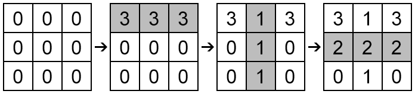

<h1 style='text-align: center;'> B. Print Check</h1>

<h5 style='text-align: center;'>time limit per test: 1 second</h5>
<h5 style='text-align: center;'>memory limit per test: 256 megabytes</h5>

Kris works in a large company "Blake Technologies". As a best engineer of the company he was assigned a task to develop a printer that will be able to print horizontal and vertical strips. First prototype is already built and Kris wants to tests it. He wants you to implement the program that checks the result of the printing.

Printer works with a rectangular sheet of paper of size *n* × *m*. Consider the list as a table consisting of *n* rows and *m* columns. Rows are numbered from top to bottom with integers from 1 to *n*, while columns are numbered from left to right with integers from 1 to *m*. Initially, all cells are painted in color 0.

Your program has to support two operations: 

1. Paint all cells in row *r**i* in color *a**i*;
2. Paint all cells in column *c**i* in color *a**i*.

If during some operation *i* there is a cell that have already been painted, the color of this cell also changes to *a**i*.

Your program has to print the resulting table after *k* operation.

## Input

The first line of the input contains three integers *n*, *m* and *k* (1  ≤  *n*,  *m*  ≤ 5000, *n*·*m* ≤ 100 000, 1 ≤ *k* ≤ 100 000) — the dimensions of the sheet and the number of operations, respectively.

Each of the next *k* lines contains the description of exactly one query: 

* 1 *r**i* *a**i* (1 ≤ *r**i* ≤ *n*, 1 ≤ *a**i* ≤ 109), means that row *r**i* is painted in color *a**i*;
* 2 *c**i* *a**i* (1 ≤ *c**i* ≤ *m*, 1 ≤ *a**i* ≤ 109), means that column *c**i* is painted in color *a**i*.
## Output

Print *n* lines containing *m* integers each — the resulting table after all operations are applied.

## Examples

## Input


```
3 3 3  
1 1 3  
2 2 1  
1 2 2  

```
## Output


```
3 1 3   
2 2 2   
0 1 0   

```
## Input


```
5 3 5  
1 1 1  
1 3 1  
1 5 1  
2 1 1  
2 3 1  

```
## Output


```
1 1 1   
1 0 1   
1 1 1   
1 0 1   
1 1 1   

```
## Note

The figure below shows all three operations for the first sample step by step. The cells that were painted on the corresponding step are marked gray. 

  

#### tags 

#1200 #constructive_algorithms #implementation 