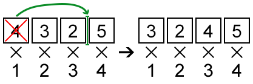

<h1 style='text-align: center;'> E. Product Sum</h1>

<h5 style='text-align: center;'>time limit per test: 1 second</h5>
<h5 style='text-align: center;'>memory limit per test: 256 megabytes</h5>

Blake is the boss of Kris, however, this doesn't spoil their friendship. They often gather at the bar to talk about intriguing problems about maximising some values. This time the problem is really special.

You are given an array *a* of length *n*. The characteristic of this array is the value  — the sum of the products of the values *a**i* by *i*. One may perform the following operation exactly once: pick some element of the array and move to any position. In particular, it's allowed to move the element to the beginning or to the end of the array. Also, it's allowed to put it back to the initial position. The goal is to get the array with the maximum possible value of characteristic.

  ## Input

The first line of the input contains a single integer *n* (2 ≤ *n* ≤ 200 000) — the size of the array *a*.

The second line contains *n* integers *a**i* (1 ≤ *i* ≤ *n*, |*a**i*| ≤ 1 000 000) — the elements of the array *a*.

## Output

Print a single integer — the maximum possible value of characteristic of *a* that can be obtained by performing no more than one move.

## Examples

## Input


```
4  
4 3 2 5  

```
## Output


```
39
```
## Input


```
5  
1 1 2 7 1  

```
## Output


```
49
```
## Input


```
3  
1 1 2  

```
## Output


```
9
```
## Note

In the first sample, one may pick the first element and place it before the third (before 5). Thus, the answer will be 3·1 + 2·2 + 4·3 + 5·4 = 39.

In the second sample, one may pick the fifth element of the array and place it before the third. The answer will be 1·1 + 1·2 + 1·3 + 2·4 + 7·5 = 49.


#### tags 

#2600 #data_structures #dp #geometry 