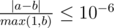

<h1 style='text-align: center;'> E. Bear and Destroying Subtrees</h1>

<h5 style='text-align: center;'>time limit per test: 5 seconds</h5>
<h5 style='text-align: center;'>memory limit per test: 512 megabytes</h5>

Limak is a little grizzly bear. He will once attack Deerland but now he can only destroy trees in role-playing games. Limak starts with a tree with one vertex. The only vertex has index 1 and is a root of the tree.

Sometimes, a game chooses a subtree and allows Limak to attack it. When a subtree is attacked then each of its edges is destroyed with probability , independently of other edges. Then, Limak gets the penalty — an integer equal to the height of the subtree after the attack. The height is defined as the maximum number of edges on the path between the root of the subtree and any vertex in the subtree.

You must handle queries of two types.

* 1 v denotes a query of the first type. A new vertex appears and its parent is *v*. A new vertex has the next available index (so, new vertices will be numbered 2, 3, ...).
* 2 v denotes a query of the second type. For a moment let's assume that the game allows Limak to attack a subtree rooted in *v*. Then, what would be the expected value of the penalty Limak gets after the attack?

In a query of the second type, Limak doesn't actually attack the subtree and thus the query doesn't affect next queries.

## Input

The first line of the input contains one integer *q* (1 ≤ *q* ≤ 500 000) — the number of queries.

Then, *q* lines follow. The *i*-th of them contains two integers *type**i* and *v**i* (1 ≤ *type**i* ≤ 2). If *type**i* = 1 then *v**i* denotes a parent of a new vertex, while if *type**i* = 2 then you should print the answer for a subtree rooted in *v**i*.

It's guaranteed that there will be at least 1 query of the second type, that is, the output won't be empty.

It's guaranteed that just before the *i*-th query a vertex *v**i* already exists.

## Output

For each query of the second type print one real number —the expected value of the penalty if Limak attacks the given subtree. Your answer will be considered correct if its absolute or relative error does not exceed 10- 6.

Namely: let's assume that your answer is *a*, and the answer of the jury is *b*. The checker program will consider your answer correct if .

## Examples

## Input


```
7  
1 1  
1 1  
2 1  
1 2  
1 3  
2 2  
2 1  

```
## Output


```
0.7500000000  
0.5000000000  
1.1875000000  

```
## Input


```
8  
2 1  
1 1  
1 2  
1 3  
1 4  
2 1  
1 4  
2 1  

```
## Output


```
0.0000000000  
0.9375000000  
0.9687500000  

```
## Note

Below, you can see the drawing for the first sample. Red circles denote queries of the second type.

  

#### tags 

#2700 #dp #math #probabilities #trees 