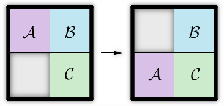

<h1 style='text-align: center;'> A. Amity Assessment</h1>

<h5 style='text-align: center;'>time limit per test: 2 seconds</h5>
<h5 style='text-align: center;'>memory limit per test: 256 megabytes</h5>

Bessie the cow and her best friend Elsie each received a sliding puzzle on Pi Day. Their puzzles consist of a 2 × 2 grid and three tiles labeled 'A', 'B', and 'C'. The three tiles sit on top of the grid, leaving one grid cell empty. To make a move, Bessie or Elsie can slide a tile adjacent to the empty cell into the empty cell as shown below:

  In order to determine if they are truly Best Friends For Life (BFFLs), Bessie and Elsie would like to know if there exists a sequence of moves that takes their puzzles to the same configuration (moves can be performed in both puzzles). Two puzzles are considered to be in the same configuration if each tile is on top of the same grid cell in both puzzles. Since the tiles are labeled with letters, rotations and reflections are not allowed.

## Input

The first two lines of the input consist of a 2 × 2 grid describing the initial configuration of Bessie's puzzle. The next two lines contain a 2 × 2 grid describing the initial configuration of Elsie's puzzle. The positions of the tiles are labeled 'A', 'B', and 'C', while the empty cell is labeled 'X'. It's guaranteed that both puzzles contain exactly one tile with each letter and exactly one empty position.

## Output

## Output

 "YES"(without quotes) if the puzzles can reach the same configuration (and Bessie and Elsie are truly BFFLs). Otherwise, print "NO" (without quotes).

## Examples

## Input


```
AB  
XC  
XB  
AC  

```
## Output


```
YES  

```
## Input


```
AB  
XC  
AC  
BX  

```
## Output


```
NO  

```
## Note

The solution to the first sample is described by the image. All Bessie needs to do is slide her 'A' tile down.

In the second sample, the two puzzles can never be in the same configuration. Perhaps Bessie and Elsie are not meant to be friends after all...


#### tags 

#1200 #brute_force #constructive_algorithms #implementation 