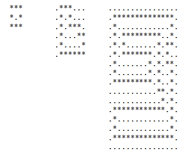

<h1 style='text-align: center;'> C. Путь Робота</h1>

<h5 style='text-align: center;'>ограничение по времени на тест: 2 секунды</h5>
<h5 style='text-align: center;'>ограничение по памяти на тест: 256 мегабайт</h5>

Вам задано прямоугольное клетчатое поле, состоящее из *n* строк и *m* столбцов. Поле содержит цикл из символов «*», такой что:

* цикл можно обойти, посетив каждую его клетку ровно один раз, перемещаясь каждый раз вверх/вниз/вправо/влево на одну клетку;
* цикл не содержит самопересечений и самокасаний, то есть две клетки цикла соседствуют по стороне тогда и только тогда, когда они соседние при перемещении вдоль цикла (самокасание по углу тоже запрещено).

Ниже изображены несколько примеров допустимых циклов:

  Все клетки поля, отличные от цикла, содержат символ «.». Цикл на поле ровно один. Посещать клетки, отличные от цикла, Роботу нельзя.

В одной из клеток цикла находится Робот. Эта клетка помечена символом «S». Найдите последовательность команд для Робота, чтобы обойти цикл. Каждая из четырёх возможных команд кодируется буквой и обозначает перемещение Робота на одну клетку:

* «U» — сдвинуться на клетку вверх,
* «R» — сдвинуться на клетку вправо,
* «D» — сдвинуться на клетку вниз,
* «L» — сдвинуться на клетку влево.

Робот должен обойти цикл, побывав в каждой его клетке ровно один раз (кроме стартовой точки — в ней он начинает и заканчивает свой путь).

Найдите искомую последовательность команд, допускается любое направление обхода цикла.

## Входные данные

В первой строке входных данных записаны два целых числа *n* и *m* (3 ≤ *n*, *m* ≤ 100) — количество строк и столбцов прямоугольного клетчатого поля соответственно.

В следующих *n* строках записаны по *m* символов, каждый из которых — «.», «*» или «S». Гарантируется, что отличные от «.» символы образуют цикл без самопересечений и самокасаний. Также гарантируется, что на поле ровно одна клетка содержит «S» и что она принадлежит циклу. Робот не может посещать клетки, помеченные символом «.».

## Выходные данные

В первую строку выходных данных выведите искомую последовательность команд для Робота. Направление обхода цикла Роботом может быть любым.

## Примеры

## Входные данные


```
3 3  
***  
*.*  
*S*  

```
## Выходные данные


```
LUURRDDL  

```
## Входные данные


```
6 7  
.***...  
.*.*...  
.*.S**.  
.*...**  
.*....*  
.******  

```
## Выходные данные


```
UULLDDDDDRRRRRUULULL  

```
## Примечание

В первом тестовом примере для обхода по часовой стрелке последовательность посещенных роботом клеток выглядит следующим образом:

1. клетка (3, 2);
2. клетка (3, 1);
3. клетка (2, 1);
4. клетка (1, 1);
5. клетка (1, 2);
6. клетка (1, 3);
7. клетка (2, 3);
8. клетка (3, 3);
9. клетка (3, 2).


#### tags 

#1100 #constructive_algorithms #dfs_and_similar #graphs 