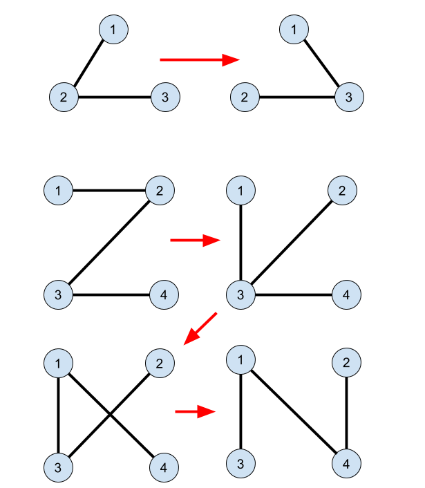

<h1 style='text-align: center;'> E. Clockwork Bomb</h1>

<h5 style='text-align: center;'>time limit per test: 6 seconds</h5>
<h5 style='text-align: center;'>memory limit per test: 256 megabytes</h5>

My name is James diGriz, I'm the most clever robber and treasure hunter in the whole galaxy. There are books written about my adventures and songs about my operations, though you were able to catch me up in a pretty awkward moment.

I was able to hide from cameras, outsmart all the guards and pass numerous traps, but when I finally reached the treasure box and opened it, I have accidentally started the clockwork bomb! Luckily, I have met such kind of bombs before and I know that the clockwork mechanism can be stopped by connecting contacts with wires on the control panel of the bomb in a certain manner.

I see *n* contacts connected by *n* - 1 wires. Contacts are numbered with integers from 1 to *n*. Bomb has a security mechanism that ensures the following condition: if there exist *k* ≥ 2 contacts *c*1, *c*2, ..., *c**k* forming a circuit, i. e. there exist *k* distinct wires between contacts *c*1 and *c*2, *c*2 and *c*3, ..., *c**k* and *c*1, then the bomb immediately explodes and my story ends here. In particular, if two contacts are connected by more than one wire they form a circuit of length 2. It is also prohibited to connect a contact with itself.

On the other hand, if I disconnect more than one wire (i. e. at some moment there will be no more than *n* - 2 wires in the scheme) then the other security check fails and the bomb also explodes. So, the only thing I can do is to unplug some wire and plug it into a new place ensuring the fact that no circuits appear.

I know how I should put the wires in order to stop the clockwork. But my time is running out! Help me get out of this alive: find the sequence of operations each of which consists of unplugging some wire and putting it into another place so that the bomb is defused. 

## Input

The first line of the input contains *n* (2 ≤ *n* ≤ 500 000), the number of contacts.

Each of the following *n* - 1 lines contains two of integers *x**i* and *y**i* (1 ≤ *x**i*, *y**i* ≤ *n*, *x**i* ≠ *y**i*) denoting the contacts currently connected by the *i*-th wire.

The remaining *n* - 1 lines contain the description of the sought scheme in the same format.

It is guaranteed that the starting and the ending schemes are correct (i. e. do not contain cicuits nor wires connecting contact with itself).

## Output

The first line should contain *k* (*k* ≥ 0) — the minimum number of moves of unplugging and plugging back some wire required to defuse the bomb.

In each of the following *k* lines output four integers *a**i*, *b**i*, *c**i*, *d**i* meaning that on the *i*-th step it is neccesary to unplug the wire connecting the contacts *a**i* and *b**i* and plug it to the contacts *c**i* and *d**i*. Of course the wire connecting contacts *a**i* and *b**i* should be present in the scheme.

If there is no correct sequence transforming the existing scheme into the sought one, output -1.

## Examples

## Input


```
3  
1 2  
2 3  
1 3  
3 2  

```
## Output


```
1  
1 2 1 3  

```
## Input


```
4  
1 2  
2 3  
3 4  
2 4  
4 1  
1 3  

```
## Output


```
3  
1 2 1 3  
4 3 4 1  
2 3 2 4  

```
## Note

Picture with the clarification for the sample tests:

  

#### tags 

#3200 #data_structures #dfs_and_similar #dsu #greedy #trees 