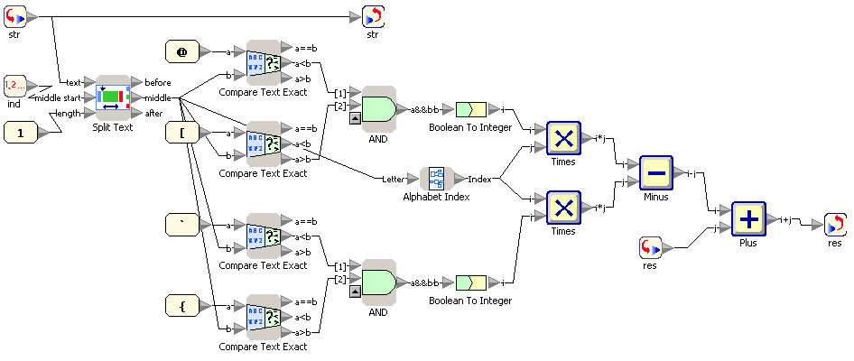

<h1 style='text-align: center;'> C. Without Text</h1>

<h5 style='text-align: center;'>time limit per test: 2 seconds</h5>
<h5 style='text-align: center;'>memory limit per test: 64 megabytes</h5>

  You can preview the image in better quality by the link: [http://assets.codeforces.com/files/656/without-text.png](//assets.codeforces.com/files/656/without-text.png)

## Input

The only line of the input is a string (between 1 and 50 characters long, inclusive). Each character will be an alphanumeric character or a full stop ".".

## Output

## Output

 the required answer.

## Examples

## Input


```
Codeforces  

```
## Output


```
-87  

```
## Input


```
APRIL.1st  

```
## Output


```
17  

```


#### tags 

#2000 #*special 