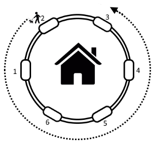

<h1 style='text-align: center;'> A. Round House</h1>

<h5 style='text-align: center;'>time limit per test: 1 second</h5>
<h5 style='text-align: center;'>memory limit per test: 256 megabytes</h5>

Vasya lives in a round building, whose entrances are numbered sequentially by integers from 1 to *n*. Entrance *n* and entrance 1 are adjacent.

Today Vasya got bored and decided to take a walk in the yard. Vasya lives in entrance *a* and he decided that during his walk he will move around the house *b* entrances in the direction of increasing numbers (in this order entrance *n* should be followed by entrance 1). The negative value of *b* corresponds to moving |*b*| entrances in the order of decreasing numbers (in this order entrance 1 is followed by entrance *n*). If *b* = 0, then Vasya prefers to walk beside his entrance.

  Illustration for *n* = 6, *a* = 2, *b* =  - 5. Help Vasya to determine the number of the entrance, near which he will be at the end of his walk.

## Input

The single line of the input contains three space-separated integers *n*, *a* and *b* (1 ≤ *n* ≤ 100, 1 ≤ *a* ≤ *n*,  - 100 ≤ *b* ≤ 100) — the number of entrances at Vasya's place, the number of his entrance and the length of his walk, respectively.

## Output

Print a single integer *k* (1 ≤ *k* ≤ *n*) — the number of the entrance where Vasya will be at the end of his walk.

## Examples

## Input


```
6 2 -5  

```
## Output


```
3  

```
## Input


```
5 1 3  

```
## Output


```
4  

```
## Input


```
3 2 7  

```
## Output


```
3  

```
## Note

The first example is illustrated by the picture in the statements.


#### tags 

#1000 #implementation #math 