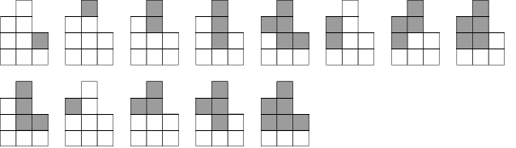

<h1 style='text-align: center;'> G. Fence Divercity</h1>

<h5 style='text-align: center;'>time limit per test: 2 seconds</h5>
<h5 style='text-align: center;'>memory limit per test: 256 megabytes</h5>

Long ago, Vasily built a good fence at his country house. Vasily calls a fence good, if it is a series of *n* consecutively fastened vertical boards of centimeter width, the height of each in centimeters is a positive integer. The house owner remembers that the height of the *i*-th board to the left is *h**i*.

Today Vasily decided to change the design of the fence he had built, by cutting his top connected part so that the fence remained good. The cut part should consist of only the upper parts of the boards, while the adjacent parts must be interconnected (share a non-zero length before cutting out of the fence).

You, as Vasily's curious neighbor, will count the number of possible ways to cut exactly one part as is described above. Two ways to cut a part are called distinct, if for the remaining fences there is such *i*, that the height of the *i*-th boards vary.

As Vasily's fence can be very high and long, get the remainder after dividing the required number of ways by 1 000 000 007 (109 + 7).

## Input

The first line contains integer *n* (1 ≤ *n* ≤ 1 000 000) — the number of boards in Vasily's fence.

The second line contains *n* space-separated numbers *h*1, *h*2, ..., *h**n* (1 ≤ *h**i* ≤ 109), where *h**i* equals the height of the *i*-th board to the left.

## Output

Print the remainder after dividing *r* by 1 000 000 007, where *r* is the number of ways to cut exactly one connected part so that the part consisted of the upper parts of the boards and the remaining fence was good.

## Examples

## Input


```
2  
1 1  

```
## Output


```
0  

```
## Input


```
3  
3 4 2  

```
## Output


```
13  

```
## Note

From the fence from the first example it is impossible to cut exactly one piece so as the remaining fence was good.

All the possible variants of the resulting fence from the second sample look as follows (the grey shows the cut out part): 

  

#### tags 

#2300 #combinatorics #dp #number_theory 