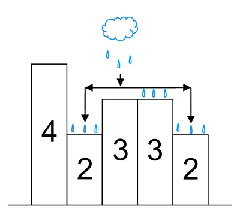

<h1 style='text-align: center;'> B. Petya and Countryside</h1>

<h5 style='text-align: center;'>time limit per test: 2 seconds</h5>
<h5 style='text-align: center;'>memory limit per test: 256 megabytes</h5>

Little Petya often travels to his grandmother in the countryside. The grandmother has a large garden, which can be represented as a rectangle 1 × *n* in size, when viewed from above. This rectangle is divided into *n* equal square sections. The garden is very unusual as each of the square sections possesses its own fixed height and due to the newest irrigation system we can create artificial rain above each section.

Creating artificial rain is an expensive operation. That's why we limit ourselves to creating the artificial rain only above one section. At that, the water from each watered section will flow into its neighbouring sections if their height does not exceed the height of the section. That is, for example, the garden can be represented by a 1 × 5 rectangle, where the section heights are equal to 4, 2, 3, 3, 2. Then if we create an artificial rain over any of the sections with the height of 3, the water will flow over all the sections, except the ones with the height of 4. See the illustration of this example at the picture:

  As Petya is keen on programming, he decided to find such a section that if we create artificial rain above it, the number of watered sections will be maximal. Help him. 

## Input

The first line contains a positive integer *n* (1 ≤ *n* ≤ 1000). The second line contains *n* positive integers which are the height of the sections. All the numbers are no less than 1 and not more than 1000.

## Output

Print a single number, the maximal number of watered sections if we create artificial rain above exactly one section.

## Examples

## Input


```
1  
2  

```
## Output


```
1  

```
## Input


```
5  
1 2 1 2 1  

```
## Output


```
3  

```
## Input


```
8  
1 2 1 1 1 3 3 4  

```
## Output


```
6  

```


#### tags 

#1100 #brute_force #implementation 