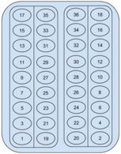

<h1 style='text-align: center;'> B. Seating On Bus</h1>

<h5 style='text-align: center;'>time limit per test: 1 second</h5>
<h5 style='text-align: center;'>memory limit per test: 256 megabytes</h5>

Consider 2*n* rows of the seats in a bus. *n* rows of the seats on the left and *n* rows of the seats on the right. Each row can be filled by two people. So the total capacity of the bus is 4*n*.

Consider that *m* (*m* ≤ 4*n*) people occupy the seats in the bus. The passengers entering the bus are numbered from 1 to *m* (in the order of their entering the bus). The pattern of the seat occupation is as below:

1-st row left window seat, 1-st row right window seat, 2-nd row left window seat, 2-nd row right window seat, ... , *n*-th row left window seat, *n*-th row right window seat.

After occupying all the window seats (for *m* > 2*n*) the non-window seats are occupied:

1-st row left non-window seat, 1-st row right non-window seat, ... , *n*-th row left non-window seat, *n*-th row right non-window seat.

All the passengers go to a single final destination. In the final destination, the passengers get off in the given order.

1-st row left non-window seat, 1-st row left window seat, 1-st row right non-window seat, 1-st row right window seat, ... , *n*-th row left non-window seat, *n*-th row left window seat, *n*-th row right non-window seat, *n*-th row right window seat.

  The seating for *n* = 9 and *m* = 36. You are given the values *n* and *m*. ## Output

 *m* numbers from 1 to *m*, the order in which the passengers will get off the bus.

## Input

The only line contains two integers, *n* and *m* (1 ≤ *n* ≤ 100, 1 ≤ *m* ≤ 4*n*) — the number of pairs of rows and the number of passengers.

## Output

Print *m* distinct integers from 1 to *m* — the order in which the passengers will get off the bus.

## Examples

## Input


```
2 7  

```
## Output


```
5 1 6 2 7 3 4  

```
## Input


```
9 36  

```
## Output


```
19 1 20 2 21 3 22 4 23 5 24 6 25 7 26 8 27 9 28 10 29 11 30 12 31 13 32 14 33 15 34 16 35 17 36 18  

```


#### tags 

#1000 #implementation 